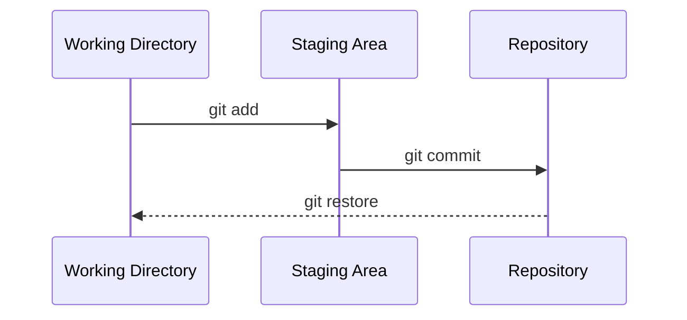

# Comandos Essenciais do Git

<!-- Este arquivo documenta os comandos Git fundamentais que todo desenvolvedor deve conhecer -->

## 📋 Objetivos de Aprendizagem

Ao final deste capítulo, você será capaz de:
- Inicializar novos repositórios e clonar projetos existentes.
- Utilizar o ciclo básico de salvamento no Git (add, commit, status).
- Visualizar o histórico e as diferenças entre as alterações realizadas.
- Desfazer pequenas mudanças e compreender os estados dos arquivos no Git.

## 🎯 Introdução

A linha de comando (ou terminal) é a interface principal e mais poderosa para interagir com o Git. Embora existam diversas interfaces gráficas, aprender os comandos fundamentais ajuda a entender como o Git realmente funciona por baixo dos panos, facilitando a resolução de problemas e dando mais flexibilidade e velocidade ao seu fluxo de trabalho de desenvolvimento.

## Estrutura dos Comandos Git

A estrutura geral da maioria dos comandos Git segue o seguinte padrão:
`git <comando> <opções> <argumentos>`

Por exemplo, no comando `git commit -m "mensagem"`, `commit` é o comando, `-m` é uma opção (flag) e `"mensagem"` é o argumento dessa opção.

### Obtendo Ajuda

Se você esquecer o que um comando faz ou quais opções ele aceita, o próprio Git possui manuais integrados muito detalhados:

```bash
# Mostra uma ajuda rápida sobre um comando específico no terminal
git <comando> -h
git add -h

# Abre o manual completo (geralmente no navegador ou paginador) sobre o comando
git help <comando>
git help commit
```

## git init

O comando `git init` é usado para criar um novo repositório Git em branco ou para reinicializar um existente. Ele transforma um diretório normal (pasta do seu computador) em um repositório Git, permitindo que você comece a rastrear as alterações nele.

### Sintaxe

```bash
git init
```

### Quando Usar

Você deve usar o `git init` quando estiver começando um projeto do zero na sua máquina local e quiser colocá-lo sob controle de versão.

### Exemplo Prático

```bash
# 1. Cria uma nova pasta para o projeto
mkdir meu-novo-projeto

# 2. Entra na pasta
cd meu-novo-projeto

# 3. Inicializa o repositório Git
git init

# 4. Verifica o resultado
ls -a # Você verá uma pasta oculta chamada .git
```

### O que Acontece

Ao rodar `git init`, o Git cria uma pasta oculta chamada `.git` dentro do seu diretório atual. Essa pasta contém todos os metadados, banco de dados de objetos e configurações necessárias para o controle de versão. Seu diretório agora é o "Working Directory".

## git clone

O comando `git clone` é usado para copiar um repositório existente, geralmente de um servidor remoto (como o GitHub), para o seu computador local.

### Sintaxe

```bash
git clone <url-do-repositorio>

# Opcional: especificar um nome de pasta diferente
git clone <url-do-repositorio> <nome-da-pasta>
```

### Diferença entre init e clone

- Use **`git init`** quando você já tem os arquivos no seu computador (ou vai criar novos) e quer iniciar o controle de versão do zero.
- Use **`git clone`** quando o repositório já existe na nuvem (GitHub, GitLab, etc.) e você quer baixar uma cópia dele para trabalhar localmente.

### Exemplo Prático

```bash
# Clonar um repositório do GitHub
git clone https://github.com/usuario/projeto-exemplo.git

# Entrar na pasta do projeto clonado
cd projeto-exemplo
```

### Clonando seu Fork

Se você fez um *fork* de um projeto de outra pessoa no GitHub, você deve clonar a URL do **seu** fork (que está na sua conta), não o repositório original. Isso permite que você envie alterações para a sua própria cópia antes de propor mudanças ao projeto principal via Pull Request.

## git add

O comando `git add` adiciona arquivos do seu diretório de trabalho (Working Directory) à área de preparação (Staging Area). Ele diz ao Git que você quer incluir as atualizações de um arquivo específico no próximo commit.

### Sintaxe

```bash
# Adiciona um arquivo específico
git add index.html

# Adiciona vários arquivos
git add arquivo1.txt arquivo2.txt

# Adiciona todos os arquivos modificados e novos na pasta atual
git add .

# Adiciona todos os arquivos do projeto (modificados, novos e deletados)
git add -A
```

### Staging Area

A "Staging Area" (área de preparação) é como um palco antes da apresentação ou um carrinho de compras. Você coloca os arquivos lá (`git add`) para prepará-los e, quando estiver pronto, tira a foto oficial ou finaliza a compra (`git commit`). Ela existe para permitir que você controle exatamente quais mudanças farão parte do próximo commit, ajudando a manter commits lógicos e organizados, em vez de salvar todas as alterações bagunçadas de uma só vez.

### Exemplos

```bash
# Você editou os arquivos index.html e style.css

# Para adicionar apenas o index.html ao próximo commit:
git add index.html

# Para adicionar tudo o que foi modificado de uma vez:
git add .
```

> [!TIP]
> **Boas Práticas**
>
> Evite usar `git add .` às cegas. Sempre verifique quais arquivos foram modificados usando `git status` antes. Prefira adicionar arquivos individualmente ou por partes lógicas para garantir que seus commits tenham um único propósito bem definido.
>
## git status

O comando `git status` exibe o estado do diretório de trabalho e da área de preparação. É o comando mais importante e você deve usá-lo o tempo todo!

### O que Mostra

Ele mostra:
- Arquivos que não estão sendo rastreados (Untracked files).
- Arquivos modificados que ainda não foram preparados (Changes not staged for commit).
- Arquivos preparados e prontos para o commit (Changes to be committed).
- Qual branch você está no momento.

### Exemplo de Saída

```bash
$ git status
On branch main
Changes to be committed:
  (use "git restore --staged <file>..." to unstage)
        modified:   index.html

Changes not staged for commit:
  (use "git add <file>..." to update what will be committed)
  (use "git restore <file>..." to discard changes in working directory)
        modified:   style.css

Untracked files:
  (use "git add <file>..." to include in what will be committed)
        script.js
```
*Na saída acima: `index.html` está na staging area; `style.css` foi modificado, mas não está preparado; `script.js` é um arquivo novo que o Git não conhece.*

### Quando Usar

Use **antes e depois** de comandos como `git add` e `git commit` para garantir que você não está fazendo nada errado. Se estiver na dúvida sobre o que fazer, rode `git status`.

## git commit

O `git commit` salva as alterações que estão na área de preparação (Staging Area) de forma permanente no histórico do repositório local.

### Sintaxe

```bash
# Faz o commit com uma mensagem inline
git commit -m "Sua mensagem aqui"

# Abre o editor de texto padrão para escrever uma mensagem (útil para mensagens longas)
git commit

# Atalho: Adiciona todos os arquivos RASTREADOS modificados e faz o commit de uma vez
git commit -am "Sua mensagem aqui" 
# Nota: O -am NÃO adiciona arquivos novos (untracked)
```

### Anatomia de um Bom Commit

Um bom commit resolve um único problema ou adiciona uma única funcionalidade. Ele não mistura correções de bugs, adição de novas funcionalidades e formatação de texto em um único grande pacote.

### Mensagens de Commit

A mensagem deve ser clara, descrevendo **o que** foi feito e, se necessário, **por que**. 

```bash
# Exemplo de BOA mensagem
git commit -m "feat: adiciona botão de login na página principal"

# Exemplo de MÁ mensagem
git commit -m "atualização"
git commit -m "arrumei uns bugs"
git commit -m "asdasdasd"
```

### Exemplo Prático

```bash
# Modifiquei o arquivo README.md
git status          # Verifico o que mudou
git add README.md   # Adiciono à staging area
git status          # Verifico se foi pra staging
git commit -m "docs: atualiza instruções de instalação no README" # Salvo
```

## git log

O `git log` mostra o histórico de commits do repositório.

### Visualizando Histórico

Ele lista os commits em ordem cronológica inversa (do mais recente para o mais antigo), mostrando o hash do commit, o autor, a data e a mensagem do commit.

### Opções Úteis

```bash
# Mostra cada commit em apenas uma linha (Hash e Mensagem)
git log --oneline

# Mostra o histórico em forma de árvore/grafo (útil quando há múltiplas branches)
git log --graph --oneline

# Filtra commits de um autor específico
git log --author="Antonio"

# Filtra commits recentes
git log --since="2 weeks ago"
```

### Interpretando a Saída

No `git log`, o "Hash" (uma string grande como `f4b82...`) é a identificação única do commit. O ponteiro `HEAD` indica onde você está atualmente na linha do tempo.

## git diff

Enquanto o `git status` mostra quais arquivos mudaram, o `git diff` mostra as linhas exatas de código que foram adicionadas ou removidas.

### Tipos de Diff

```bash
# Mostra as diferenças entre o Working Directory e a Staging Area
# (O que você mudou, mas ainda não fez "git add")
git diff

# Mostra as diferenças entre a Staging Area e o último commit
# (O que vai entrar no próximo commit)
git diff --staged

# Mostra a diferença entre as alterações totais não comitadas e o último commit
git diff HEAD

# Compara dois commits diferentes usando seus Hashes
git diff <hash_antigo> <hash_novo>
```

### Lendo a Saída

Na saída do diff:
- Linhas que começam com `+` (geralmente verdes) indicam código adicionado.
- Linhas que começam com `-` (geralmente vermelhas) indicam código removido.

## git restore

O `git restore` é um comando moderno introduzido em versões mais recentes do Git para desfazer alterações e remover arquivos da staging area de forma mais intuitiva que o antigo `git reset` e partes do `git checkout`.

### Desfazendo Mudanças

```bash
# Desfaz as alterações de um arquivo no Working Directory (volta para o estado do último commit)
# CUIDADO: Isso APAGA suas alterações não salvas definitivamente!
git restore index.html

# Remove o arquivo da Staging Area (Unstage), mas MANTÉM as alterações no arquivo
git restore --staged index.html
```

### Diferença de git checkout

Antigamente, usava-se `git checkout` tanto para trocar de branches quanto para desfazer alterações em arquivos. O Git dividiu isso em dois comandos mais semânticos: `git switch` (para trocar de branches) e `git restore` (para restaurar/desfazer arquivos).

## git rm

O comando `git rm` remove arquivos do seu diretório de trabalho e simultaneamente atualiza a staging area para registrar essa remoção no próximo commit.

### Removendo Arquivos

```bash
# Remove o arquivo e prepara a remoção
git rm arquivo-obsoleto.txt
git commit -m "chore: remove arquivo obsoleto"
```

### Diferença de rm normal

Se você usar o comando de terminal normal `rm arquivo.txt`, o arquivo some, mas o Git o registra como uma "Change not staged". Você teria que rodar `git add arquivo.txt` para preparar a remoção. O `git rm` faz os dois passos de uma vez.

## git mv

Usado para mover ou renomear arquivos.

### Renomeando/Movendo Arquivos

```bash
# Renomear um arquivo
git mv nome-antigo.txt nome-novo.txt

# Mover um arquivo para uma pasta
git mv arquivo.txt pasta/arquivo.txt
```
O Git reconhece automaticamente como uma alteração do tipo renomeação, deixando preparado (staged) para o commit.

## Fluxo de Trabalho Básico

O fluxo de trabalho clássico (e infinito) do desenvolvedor no Git é:



### Exemplo Completo

```bash
git clone https://github.com/meu-usuario/projeto.git
cd projeto
# [Eu edito alguns arquivos de código]
git status
git add app.js index.html
git commit -m "feat: adiciona lógica inicial do app"
git log --oneline
```

## Comandos de Consulta

### git show

Mostra o conteúdo detalhado, mensagens e as alterações de um commit específico.

```bash
# Ver os detalhes do último commit (HEAD)
git show HEAD

# Ver detalhes de um commit através de seu Hash
git show a1b2c3d
```

### git blame

Mostra quem modificou cada linha de um arquivo por último, exibindo o autor e o hash do commit. Ótimo para descobrir quem causou aquele bug ou tirar dúvidas com o autor do trecho de código.

```bash
git blame arquivo.txt
```

## Exemplos Práticos

### Exemplo 1: Criando Primeiro Repositório

```bash
mkdir novo-site
cd novo-site
git init
echo "# Meu Novo Site" > README.md
git status
git add README.md
git commit -m "docs: cria o README inicial"
git log --oneline
```

### Exemplo 2: Clonando e Contribuindo

```bash
git clone https://github.com/exemplo/repositorio.git
cd repositorio
# Editar um arquivo
git status
git diff
git add .
git commit -m "fix: corrige erro de digitação"
```

### Exemplo 3: Desfazendo Alterações

```bash
# Se eu fiz uma alteração indesejada num arquivo
git status
git restore index.html # Minha alteração errada some, volto ao código limpo do último commit
```

## Erros Comuns

> [!WARNING]
> **Erro 1: Esquecer de git add**
>
> Fazer um `git commit` achando que as alterações serão salvas, mas o Git diz que não há nada para commitar. 
> **Solução:** Sempre rode `git status` e `git add` antes.
>
> [!WARNING]
> **Erro 2: Mensagem de commit vaga**
>
> Escrever `git commit -m "ok"` ou `git commit -m "mudanças"`. Em seis meses, você não fará ideia do que isso significa. 
> **Solução:** Descreva **o que** mudou de forma resumida e direta.
>
> [!WARNING]
> **Erro 3: Committar arquivos errados**
>
> Fazer um `git add .` às cegas e acidentalmente adicionar senhas, chaves de API ou arquivos pesados/pessoais que não deveriam ir para o repositório.
> **Solução:** Sempre use `git status` antes de adicionar, e aprenda sobre `.gitignore`.
>
> [!WARNING]
> **Erro 4: Confundir git reset e git restore**
>
> - `git restore`: Trabalha nos arquivos. Usado para desfazer modificações em arquivos soltos.
> - `git reset`: Trabalha na linha do tempo. Usado para voltar ou desfazer commits inteiros (veja no capítulo de resolução de problemas).
>
## Exercícios

1. Crie uma nova pasta no seu computador chamada `treino-git` e transforme-a em um repositório Git usando `git init`.
2. Crie um arquivo `anotacoes.txt`, adicione um texto qualquer, e faça seu primeiro `commit`.
3. Altere o texto desse arquivo. Rode `git diff` para visualizar a alteração no terminal, depois adicione (`add`) e comite (`commit`).
4. Visualize seu histórico com `git log --oneline`.
5. Modifique o arquivo de novo, mas não adicione (sem `add`). Use o comando `git restore` para descartar a sua mudança e confirme rodando `git status`.

## Tabela de Referência Rápida

| Comando | O que faz | Quando usar |
|---------|-----------|-------------|
| `git init` | Inicializa um novo repositório em branco | No início de um projeto novo localmente |
| `git clone` | Baixa uma cópia de um repositório da web | Para trabalhar em um projeto já existente |
| `git add` | Move mudanças para a Staging Area | Antes de committar, para separar suas alterações |
| `git commit` | Salva um snapshot (foto) na linha do tempo | Para salvar um grupo de mudanças lógicas concluídas |
| `git status` | Exibe o estado atual dos arquivos | Constantemente, para saber o que está acontecendo |
| `git log` | Exibe o histórico de commits | Para ver o que foi feito no passado e por quem |
| `git diff` | Exibe as linhas exatas que foram alteradas | Para revisar suas mudanças detalhadamente antes do add/commit |
| `git restore` | Desfaz alterações ou tira da staging area | Para descartar código indesejado que não foi comitado |

## Recursos Adicionais

- [Git Reference Manual - Comandos Principais](https://git-scm.com/docs)
- [Git Cheat Sheet Interativo](https://ndpsoftware.com/git-cheatsheet.html)
- [Aprenda Git Branching (Visual e Prático)](https://learngitbranching.js.org/)

## Resumo

- O ciclo de vida do salvamento de arquivos no Git é essencialmente: `Modificar -> git add -> git commit`.
- **`git status`** é o seu melhor amigo. Use sem moderação.
- O histórico é valioso e permanente (`git log`).
- O **`git diff`** mostra *exatamente* o que mudou, enquanto o status mostra *onde* mudou.
- Você pode sempre recuar de erros nos arquivos modificados usando **`git restore`**.


---

<div align="center">

[⬅️ Capítulo Anterior: 01. Conceitos Básicos](./01-conceitos-basicos.md)
 | 
[Capítulo Seguinte: 03. Branching e Merge ➡️](./03-branching-e-merge.md)

</div>

## 👥 Contribuidores

Este conteúdo é colaborativo. Contribuidores deste arquivo:
- [@bigauke](https://github.com/bigauke) (Antonio Daniel de Souza Linhares) - Preenchimento do conteúdo sobre Comandos Essenciais.
