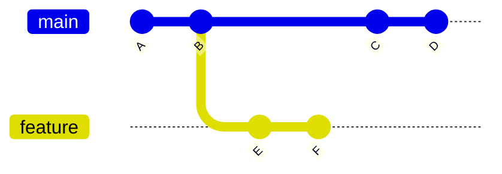
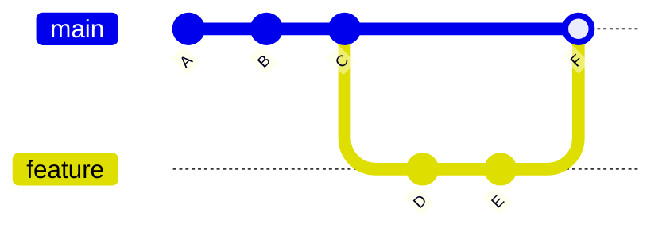

# Branching e Merge

<!-- Este arquivo explica como trabalhar com branches e fazer merge no Git -->

## 📋 Objetivos de Aprendizagem

Ao final deste capítulo, você será capaz de:
- Compreender o conceito de branches (ramificações) e sua importância no desenvolvimento.
- Criar, listar, trocar e deletar branches no repositório.
- Unir (merge) diferentes branches de forma segura.
- Compreender a diferença entre os tipos de merge (Fast-Forward e Three-Way).
- Lidar com o estado do diretório de trabalho ao mudar de contexto.

## 🎯 Introdução

O uso de branches é, sem dúvida, o recurso mais poderoso e utilizado do Git. Ele permite que desenvolvedores trabalhem no mesmo projeto simultaneamente, sem interferirem no código uns dos outros. As branches possibilitam o desenvolvimento paralelo, a experimentação segura de novas ideias e a organização clara de funcionalidades, correções e atualizações.

## O que são Branches?

Uma *branch* (ramificação) é essencialmente um ponteiro móvel para um commit específico no histórico do seu projeto. Pense nela como uma "linha do tempo alternativa" ou um "universo paralelo" do seu código. Quando você cria uma branch, está criando um ambiente isolado onde pode fazer alterações sem afetar a versão principal do projeto.

### Por que Usar Branches?

- **Isolamento:** Alterações feitas em uma branch não afetam as outras. Se o seu código quebrar, a branch principal continua intacta.
- **Trabalho Paralelo:** Várias pessoas ou times podem desenvolver diferentes funcionalidades ao mesmo tempo.
- **Revisão de Código:** Facilita a revisão (Code Review) através de Pull Requests antes que o código seja integrado à versão oficial.
- **Testes Livres:** Você pode criar uma branch apenas para testar uma ideia maluca; se não der certo, é só deletá-la e voltar para onde estava.

### Visualizando Branches

Imagine que a linha principal do seu projeto avance commit a commit. Ao criar uma branch de `feature`, ela se separa da linha principal, cria seus próprios commits e, futuramente, pode ser unida de volta.



## Branch Principal (main/master)

A branch principal é a linha do tempo "oficial" do seu projeto, que deve conter sempre o código estável e funcional. Tradicionalmente chamada de `master`, a comunidade adotou o termo `main` como padrão moderno. Geralmente, essa branch é protegida nas configurações do repositório remoto (como no GitHub) para evitar que alterações sejam feitas nela diretamente sem passar por revisão.

## Trabalhando com Branches

### Listar Branches

Para ver quais branches existem no seu repositório local:

```bash
# Lista todas as branches locais. O asterisco (*) indica a branch atual.
git branch

# Lista todas as branches (locais e remotas)
git branch -a
```

### Criar uma Nova Branch

Para criar uma ramificação a partir do ponto atual onde você está:

```bash
git branch <nome-da-branch>
```

#### Boas Práticas de Nomenclatura

Dar bons nomes às branches ajuda o time a entender rapidamente o que está sendo feito nelas. É comum usar prefixos com barras:
- `feature/login-usuario` para novas funcionalidades.
- `fix/botao-quebrado` para correção de bugs.
- `docs/atualiza-readme` para documentação.

### Trocar de Branch

Para navegar entre as linhas do tempo (branches):

```bash
# Comando tradicional para trocar de branch
git checkout <nome-da-branch>

# Comando moderno e recomendado especificamente para trocar de branches
git switch <nome-da-branch>
```

### Criar e Trocar em Um Comando

Na prática, quase sempre que criamos uma branch, queremos ir imediatamente para ela. Existem atalhos para isso:

```bash
# O comando tradicional
git checkout -b <nome-da-nova-branch>

# O comando moderno equivalente
git switch -c <nome-da-nova-branch>
```

## Estados do Working Directory

Ao trocar de branch usando `git switch` ou `git checkout`, o Git atualiza instantaneamente os arquivos na pasta do seu projeto (Working Directory) para refletirem exatamente o código contido naquela branch. 

### Mudanças Não Commitadas

Se você tiver arquivos modificados (não commitados) e tentar trocar de branch, o Git analisará:
- Se as mudanças *não conflitarem* com a nova branch, o Git as leva junto com você.
- Se *houver conflitos*, o Git impedirá a troca e exibirá um erro pedindo que você faça um commit ou descarte as mudanças (ou use o `stash`, que veremos adiante).

## Merge: Unindo Branches

### O que é Merge?

Merge é a operação de pegar as mudanças desenvolvidas em uma branch separada (ex: `feature`) e aplicá-las em outra branch (ex: `main`). É como dizer: "Ok, o código do universo paralelo está pronto, agora vamos trazê-lo para a realidade principal".

### Sintaxe Básica

Para fazer um merge, você **sempre deve estar na branch de destino** (a branch que vai receber as mudanças).

```bash
# 1. Troque para a branch que vai receber as alterações
git switch main

# 2. Execute o merge trazendo a branch desejada
git merge <nome-da-branch-feature>
```

### Exemplo de Merge

```bash
# Criar e ir para nova branch
git switch -c feature/nova-tela

# ... faço edições no código ...
git add .
git commit -m "feat: adiciona nova tela de perfil"

# Volto para a branch principal
git switch main

# Incorporo a nova funcionalidade à main
git merge feature/nova-tela
```

## Tipos de Merge

O Git resolve a união das branches basicamente de duas maneiras automáticas:

### Fast-Forward Merge

Acontece quando a branch de destino (`main`) **não teve nenhum commit novo** desde que a branch de `feature` foi criada. Como o caminho é direto, o Git simplesmente move o ponteiro da `main` "para frente" (fast-forward) até o commit mais recente da `feature`.


### Three-Way Merge

Acontece quando a branch de destino (`main`) avançou com novos commits enquanto a branch de `feature` também avançava. O Git precisa olhar três pontos: o commit comum onde elas se separaram (ancestral) e os topos atuais de ambas.



### Merge Commit

No caso do Three-Way, o Git cria automaticamente um novo commit, chamado de **Merge Commit** (indicado pela letra `F` no esquema acima). Ele tem uma característica especial: possui dois *parents* (dois commits ancestrais), marcando historicamente onde a união ocorreu.

## Estratégias de Merge

Na linha de comando, podemos forçar o comportamento do merge através de opções (flags):

### --ff (Fast-Forward)

É o comportamento padrão do Git se for possível fazer um fast-forward. Não cria um commit de merge.

```bash
git merge feature-nome # Usa --ff por padrão
```

### --no-ff (No Fast-Forward)

Força o Git a **sempre** criar um merge commit, mesmo que um fast-forward fosse possível. É muito usado em equipes para manter um registro visual de onde uma feature começou e terminou.

```bash
git merge --no-ff feature-nome
```

### --squash

O `squash` pega todos os commits da branch de `feature` e os comprime em uma única alteração no Working Directory, sem comitá-los automaticamente. Você então faz um único commit na branch principal com todas as novidades agregadas.

```bash
git merge --squash feature-nome
git commit -m "feat: pacote de funcionalidades finalizado"
```

## Deletando Branches

Depois de um merge bem-sucedido, a branch de feature não é mais necessária e pode ser excluída para manter a organização.

```bash
# Deletar branch local (o Git impede se ela não tiver sido mergiada ainda, por segurança)
git branch -d <nome-da-branch>

# Forçar a deleção da branch (mesmo sem merge)
git branch -D <nome-da-branch>

# Deletar a branch no servidor remoto (ex: GitHub)
git push origin --delete <nome-da-branch>
```

### Quando Deletar Branches

A melhor prática é deletar a branch logo após o código dela ter sido aprovado e mergiado na branch principal.

## Visualizando o Grafo

O terminal pode desenhar o histórico das branches e seus merges de forma bastante ilustrativa:

```bash
git log --graph --oneline --all
```

## Branch Tracking

### Upstream Branch

Quando você envia uma branch local para o GitHub pela primeira vez, o Git precisa saber qual é a branch "gêmea" dela lá no servidor. Esse link é chamado de configuração de *upstream*.

```bash
# Ao fazer push pela primeira vez, cria a branch no remoto e vincula as duas
git push -u origin <nome-da-branch>

# A partir daí, basta digitar:
git push
```

## Exemplos Práticos

### Exemplo 1: Feature Branch Workflow

```bash
# Atualiza localmente
git pull origin main

# Cria a nova branch
git switch -c feature/dark-mode

# Trabalha...
git add .
git commit -m "feat: adiciona tema escuro"

# Retorna e integra
git switch main
git merge feature/dark-mode

# Limpa a casa
git branch -d feature/dark-mode
```

### Exemplo 2: Desfazendo um Merge

Se você fez o merge na branch errada antes de enviar pro servidor:

```bash
# Remove o último commit (o do merge indesejado) da branch atual
git reset --hard HEAD~1
```

## Boas Práticas

- **Mantenha branches pequenas:** Elas devem durar pouco tempo, de preferência dias, não meses.
- **Commits frequentes:** Salve o progresso regularmente.
- **Merge com frequência:** Traga mudanças da `main` para a sua branch (`git merge main`) frequentemente para evitar um acúmulo gigante de alterações conflitantes no final.
- **Delete após usar:** Fez o merge, apague a branch.
- **Não comite na main:** Em times profissionais, o fluxo natural é sempre criar branch, aprovar e mergiar.

## Workflows Comuns

### Feature Branch Workflow

O fluxo mais clássico: a `main` é sagrada. Todo o novo desenvolvimento de qualquer funcionalidade, correção ou teste é feito numa branch dedicada (`feature/...`). Quando pronto, abre-se um Pull Request no GitHub para revisar e fundir à `main`.

### Gitflow

Um modelo robusto e engessado que cria diferentes ramificações permanentes (como `develop`, `release`, `hotfix`). Útil em empresas com ciclos de lançamentos baseados em versões super rigorosas. (Sera detalhado em outro capítulo).

## Conflitos de Merge

Muitas vezes, duas branches modificam **exatamente a mesma linha** do mesmo arquivo. O Git, não sabendo qual versão é a correta, para o merge e sinaliza um "Conflito" (*Merge Conflict*).

### O que São

Conflitos são apenas o Git pedindo a intervenção humana para escolher qual código deve prevalecer. O Git insere marcações visuais (`<<<<<<<`, `=======`, `>>>>>>>`) no código conflitante para que você leia, decida, edite o arquivo apagando os marcadores e depois faça um commit para concluir o merge. (Esse processo é detalhado no Capítulo 06).

## git stash

Se você estiver no meio de um trabalho confuso e precisar trocar de branch urgentemente para arrumar um bug rápido na `main`, você pode usar a "gaveta" do Git: o `stash`.

### Quando Usar Stash

O comando `stash` pega todas as suas alterações não comitadas e as guarda temporariamente, limpando seu diretório. Assim, você pode trocar de branch livremente. Quando voltar, você as retira da gaveta.

```bash
# Guarda mudanças temporariamente na gaveta
git stash

# Tira a última coisa guardada da gaveta e aplica nos arquivos
git stash pop

# Vê o que tem guardado
git stash list
```

## Comparando Branches

Para ver o que tem de diferente no código da sua branch em relação à `main` antes do merge:

```bash
# Mostra o código diferente (diff) entre duas branches
git diff main..minha-branch
```

## Erros Comuns

> [!WARNING]
> **Erro 1: Merge na Branch Errada**
>
> Você queria fundir na `main`, mas sem perceber estava na branch `teste` e fez o merge nela.
> **Solução:** Use o `git status` ou olhe a indicação no seu terminal para sempre ter certeza de qual branch está (`git switch`) antes de invocar o `git merge`. Se errar, pode ser revertido via `git reset`.
>
> [!WARNING]
> **Erro 2: Deletar Branch Sem Merge**
>
> Tentar apagar uma branch com código não finalizado usando `git branch -D` (forçado).
> **Solução:** Sempre tente usar `-d` (minúsculo), o Git só permitirá deletar se tiver certeza de que as alterações já estão salvas na branch principal.
>
> [!WARNING]
> **Erro 3: Não Atualizar a Main Antes de Criar Branch**
>
> Criar uma branch a partir de uma `main` antiga na sua máquina, resultando em dezenas de conflitos na hora de integrar meses depois.
> **Solução:** Sempre rode `git pull origin main` e certifique-se de ter os arquivos atualizados antes de dar o `git switch -c`.
>
## Exercícios

1. Crie uma nova branch chamada `docs/primeiro-teste` e troque para ela.
2. Adicione ou altere um arquivo. Faça o `git add` e o `git commit`.
3. Volte para a branch principal (`git switch main`). Observe que as suas alterações "sumiram" dos arquivos!
4. Realize a união usando `git merge docs/primeiro-teste` para que a `main` incorpore as mudanças.
5. Delete a branch usando `git branch -d docs/primeiro-teste`.

## Tabela de Referência

| Comando | Descrição |
| --- | --- |
| `git branch` | Lista as branches locais. |
| `git switch <branch>` | Troca para a branch especificada. |
| `git switch -c <branch>` | Cria uma nova branch e já troca para ela. |
| `git merge <branch>` | Junta a branch informada para dentro da branch atual. |
| `git branch -d <branch>` | Deleta a branch local (se já tiver sido mergiada). |
| `git stash` | Guarda alterações não comitadas temporariamente na gaveta. |

## Recursos Adicionais

- [Learn Git Branching (Game interativo incrível!)](https://learngitbranching.js.org/)
- [Atlassian Git Branching Tutorial](https://www.atlassian.com/git/tutorials/using-branches)

## Resumo

- **Branches** são universos paralelos de desenvolvimento que isolam as alterações.
- Use **`git switch`** para viajar entre esses universos.
- Use **`git merge`** a partir da branch de destino (ex: `main`) para fundir as alterações de outra branch.
- Sempre tente atualizar sua branch local antes de criar novos trabalhos paralelos para evitar dores de cabeça no futuro.
- Acostume-se a **deletar** as branches após os merges para manter a organização do time.


---

<div align="center">

[⬅️ Capítulo Anterior: 02. Comandos Essenciais](./02-comandos-essenciais.md)
 | 
[Capítulo Seguinte: 04. Pull Requests e Review ➡️](./04-pull-requests-e-review.md)

</div>

## 👥 Contribuidores

Este conteúdo é colaborativo. Contribuidores deste arquivo:
- [@bigauke](https://github.com/bigauke) (Antonio Daniel de Souza Linhares) - Preenchimento do conteúdo sobre Branching e Merge.