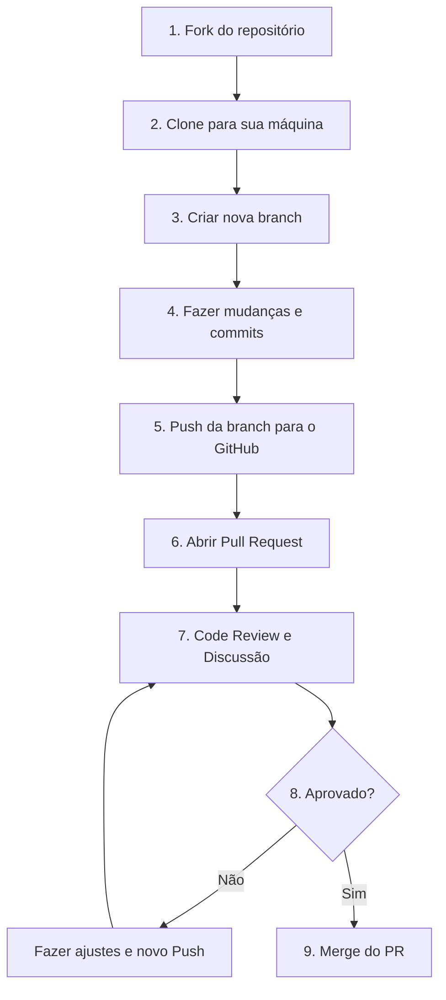

# Pull Requests e Code Review

<!-- Este arquivo explica o workflow de Pull Requests e revisão de código no GitHub -->

## 📋 Objetivos de Aprendizagem

Ao final deste capítulo, você será capaz de:
- Entender o que é um Pull Request e sua importância no ciclo de desenvolvimento de software.
- Criar, configurar e gerenciar um Pull Request no GitHub.
- Realizar revisões de código (Code Review) eficientes e construtivas.
- Lidar de forma profissional com os feedbacks recebidos no seu próprio código.
- Compreender os diferentes métodos para realizar o merge de um Pull Request.

## 🎯 Introdução

No desenvolvimento de software moderno, escrever o código é apenas metade do trabalho; a outra metade é garantir que ele seja legível, seguro e perfeitamente integrado ao restante do projeto. É aqui que entram os Pull Requests (PRs) e as revisões de código (Code Review). Eles são o coração da colaboração assíncrona, permitindo que equipes espalhadas pelo mundo discutam e melhorem o código antes que ele chegue aos usuários finais.

## O que é um Pull Request (PR)?

Um Pull Request (ou "PR", como é comumente chamado) **não é um comando do Git**. É uma funcionalidade de plataformas de hospedagem de código como o GitHub, GitLab ou Bitbucket. 

Um PR é literalmente um pedido: "Ei, eu fiz algumas alterações na minha branch. Por favor, puxe (pull) essas alterações para a branch principal (main) do projeto".

### Pull Request vs Merge

Enquanto o comando `git merge` junta as branches silenciosamente na sua máquina local, o Pull Request é a versão "social" e baseada na web desse processo. Ele cria um fórum de discussão onde as diferenças de código (diffs) são exibidas visualmente, permitindo que outras pessoas comentem linha por linha antes de a união (merge) realmente acontecer.

### Por que Usar Pull Requests?

- **Revisão por Pares (Peer Review):** Quatro olhos veem melhor que dois. Ajuda a pegar bugs antes que cheguem à produção.
- **Discussão Técnica:** É um espaço seguro para discutir arquitetura e design de software.
- **Integração Contínua (CI/CD):** PRs podem disparar testes automáticos para garantir que seu código não quebrou nada.
- **Histórico e Documentação:** Um bom PR conta a história do porquê uma decisão técnica foi tomada.
- **Mentoria e Aprendizado:** Desenvolvedores juniores aprendem lendo o código dos seniores, e vice-versa.

## Workflow com Pull Requests

O fluxo clássico de trabalho usando PRs no GitHub geralmente segue estes passos:



## Criando um Pull Request

### Pré-requisitos

Antes de abrir um PR, você precisa ter:
- Feito commits das suas alterações em uma branch que **não seja a main**.
- Enviado (feito o push) essa branch para o servidor remoto (GitHub).

### Passo a Passo

#### 1. Fazer Push da Branch

Suba sua branch local para o GitHub:

```bash
git push -u origin nome-da-sua-branch
```

#### 2. Abrir PR no GitHub

1. Acesse a página do repositório no GitHub.
2. O GitHub é inteligente e provavelmente mostrará um banner amarelo dizendo *"nome-da-sua-branch had recent pushes"* com um botão verde **"Compare & pull request"**. Clique nele.
3. Se o botão não aparecer, vá na aba "Pull requests" e clique em "New pull request".

#### 3. Preencher Informações

Nesta tela, você deve explicar o que você fez. Um bom PR é como um bom e-mail corporativo: claro, direto e explicativo.

##### Título do PR

Seja conciso. Use prefixos que indiquem o tipo de mudança.
- **Bom:** `feat: adiciona botão de exportar para PDF`
- **Ruim:** `mudanças no botão` ou `atualizando arquivos`

##### Descrição

O que o revisor precisa saber para entender este PR?
- **Contexto:** Qual problema isso resolve?
- **Mudanças:** O que foi tecnicamente alterado?
- **Visual:** Se mudou a interface (UI), inclua um *Screenshot* (captura de tela) ou um pequeno vídeo/GIF mostrando o "Antes" e o "Depois".
- **Como testar:** Instruções rápidas de como o revisor pode rodar o seu código.

#### 4. Referenciar Issues

Se este PR resolve um bug ou tarefa mapeada nas "Issues" do GitHub, você pode vinculá-los. O GitHub fechará a issue automaticamente quando o PR for aprovado e mesclado.

Escreva na descrição:
```text
Closes #123
Fixes #456
Resolves #789
```

## Anatomia de um Bom Pull Request

### Tamanho

**PRs pequenos são revisados rápido e com qualidade. PRs gigantescos são aprovados sem que ninguém os leia direito.** 
Tente limitar seus PRs a uma única funcionalidade ou correção de bug. Se estiver ficando muito grande, divida o trabalho em PRs menores.

### Commits

Mantenha um histórico de commits lógico e organizado. Cada commit deve representar uma pequena unidade de trabalho que faz sentido isoladamente.

### Testes

Se o projeto tiver testes automatizados, certifique-se de escrever testes para o seu novo código ou atualizar os testes existentes para não quebrarem. Um PR sem testes em um projeto que exige testes será rapidamente rejeitado.

## Code Review: Revisando PRs

### O que é Code Review?

É a prática onde um ou mais colegas de equipe examinam o seu código submetido no PR antes que ele seja aceito. Eles procuram por erros, problemas de lógica, vulnerabilidades de segurança e desvios de padronização do projeto.

### Por que Revisar Código?

- **Qualidade e Segurança:** Reduz a chance de bugs e falhas críticas.
- **Conhecimento Compartilhado:** Evita que apenas uma pessoa no time saiba como uma parte específica do sistema funciona.
- **Padrões:** Mantém o estilo de código consistente.

### Como Ser um Bom Revisor

Revisar código é uma habilidade interpessoal tanto quanto técnica.

#### 1. Entender o Contexto

Antes de olhar o código, leia o título, a descrição do PR e a Issue vinculada. Entenda qual era o objetivo do desenvolvedor.

#### 2. Revisar o Código

O que procurar:
- O código atende ao objetivo proposto?
- É fácil de ler e entender? As variáveis e funções têm bons nomes?
- Existe algum erro de lógica evidente?
- Afeta negativamente a performance do sistema?
- A documentação (como o README) precisa ser atualizada?

#### 3. Fazer Comentários Construtivos

Sempre critique o **código**, nunca o **programador**. Faça perguntas em vez de dar ordens. Ofereça alternativas.

##### Exemplos de Bons Comentários

```text
✅ "Boa sacada! Sugiro apenas adicionar um comentário aqui explicando por que multiplicamos por 100."
✅ "Este bloco pode ficar mais simples se usarmos a função nativa `map()`. O que acha?"
✅ "Encontrei um pequeno erro de digitação na linha 23: de 'comit' para 'commit'."
```

##### Exemplos de Comentários Ruins

```text
❌ "Está tudo errado, refaça."
❌ "Por que você fez essa gambiarra?"
❌ "Eu faria diferente." (Se faria diferente, explique o motivo técnico).
```

#### 4. Usar Sugestões

O GitHub possui um botão de "Suggestion" (Sugestão) no editor de comentários. Ele permite que você sugira a linha de código exata que substituiria a linha atual. O autor do PR pode aceitar a sugestão com um clique, e o GitHub faz o commit automaticamente para ele.

#### 5. Solicitar Alterações ou Aprovar

No final da revisão, você deve submeter (Submit Review) com uma de três opções:
- **Comment:** Apenas deixando comentários ou perguntas neutras.
- **Approve:** O código está ótimo, pronto para ser integrado.
- **Request changes:** Há problemas que devem ser corrigidos antes do código ser aceito.

## Respondendo a Code Review

### Como Autor do PR

#### Recebendo Feedback

Não leve os comentários para o lado pessoal. Todo mundo comete erros e a revisão existe justamente para proteger o projeto. O revisor está ali para ajudar.

#### Discutindo Construtivamente

Se você discorda de um comentário, explique tecnicamente e educadamente o porquê você escolheu aquela abordagem. Se não chegarem a um consenso via texto, façam uma ligação rápida (call).

#### Fazendo Alterações

Se o revisor pediu mudanças:
1. Volte para o seu terminal, na branch do PR.
2. Faça as alterações no código.
3. Faça o commit e o push normalmente.

```bash
git add arquivo-corrigido.js
git commit -m "fix: ajusta função conforme feedback da revisão"
git push
```
O GitHub atualizará o PR automaticamente com os novos commits!

#### Marcar Conversas como Resolvidas

Quando você tiver implementado a sugestão de um comentário, clique no botão "Resolve conversation" (Resolver conversa) no GitHub. Isso ajuda o revisor a saber que você tratou aquele ponto.

## Estados de um Pull Request

### Draft (Rascunho)

O PR foi criado, mas você sinaliza que ainda está trabalhando nele. Ele não está pronto para ser revisado nem mergiado.

### Open (Aberto)

O PR está pronto. A equipe já pode começar a revisá-lo.

### Changes Requested (Mudanças Solicitadas)

Um revisor encontrou problemas que impedem o PR de ser aprovado no momento. Você precisa enviar novos commits corrigindo os apontamentos.

### Approved (Aprovado)

Os revisores deram o sinal verde. O código atende a todos os requisitos do projeto.

### Merged (Mesclado/Unido)

O PR foi concluído com sucesso e o código foi permanentemente integrado à branch principal (main). O PR fica com o status roxo e não pode ser reaberto.

### Closed (Fechado)

O PR foi fechado sem ter sido integrado (merge) ao projeto principal. Isso acontece se a ideia foi descartada ou substituída por outra solução.

## Merge de Pull Requests

Na hora de aprovar e realizar o merge de um PR no GitHub, geralmente existem três opções (se habilitadas pelos administradores do repositório):

### Tipos de Merge no GitHub

#### Create a Merge Commit

A abordagem clássica (`git merge --no-ff`). Ele preserva todos os seus commits originais e adiciona um "Commit de Merge" extra na branch principal indicando a união das linhas do tempo. Excelente para rastreabilidade de histórico.

#### Squash and Merge

Pega todos os pequenos commits que você fez durante o PR (ex: "faz botão", "arruma cor do botão", "corrige typo no botão") e os comprime ("squash") em apenas **um grande commit limpo** na branch principal. É a opção favorita de muitas equipes para manter o histórico da main bonito e organizado.

#### Rebase and Merge

Ele pega os seus commits do PR e os reaplica de forma linear no topo da branch principal, como se você tivesse acabado de escrevê-los. Não cria um "Commit de Merge". Cria um histórico perfeitamente reto, mas pode ser confuso em alguns casos.

## Conflitos em Pull Requests

Se a branch principal (`main`) avançou modificando os mesmos arquivos que você editou no seu PR, o GitHub mostrará a mensagem: *"This branch has conflicts that must be resolved"*.

### Resolvendo na Interface do GitHub

Para conflitos muito simples (como texto no README), o GitHub oferece um botão "Resolve conflicts" que abre um editor na própria web para você corrigir.

### Resolvendo Localmente

A forma mais segura, ideal para conflitos de código real:
1. Vá para o seu terminal e atualize sua `main` local.
2. Troque para a sua branch do PR.
3. Faça um merge (ou rebase) da `main` atualizada para dentro da sua branch.
4. Resolva os conflitos no seu editor de código (VSCode, etc).
5. Comite e faça o push. O PR no GitHub ficará limpo automaticamente.

```bash
git switch main
git pull origin main
git switch minha-branch-do-pr
git merge main
# Resolva os conflitos...
git add .
git commit -m "Merge main para resolver conflitos"
git push
```

## CI/CD e Checks

Se o repositório possuir integrações (como GitHub Actions), o PR fará verificações (Checks) automáticas. Elas aparecem no fundo da página do PR.

### Status Checks

Podem ser testes automatizados (Testes Unitários), linters (para verificar formatação de código) ou análises de segurança. Geralmente, a equipe configura o repositório para **bloquear o merge** caso algum desses checks falhe (fique com o "X" vermelho).

### Como Lidar com Checks Falhando

Clique em "Details" ao lado do check vermelho para ler os logs e entender o que quebrou. Corrija o erro no seu código local, faça o commit e o push. Os testes rodarão novamente de forma automática.

## Templates de Pull Request

Muitos projetos open source e corporativos utilizam arquivos de template (ex: `.github/PULL_REQUEST_TEMPLATE.md`). Quando você abre um PR, o GitHub preenche automaticamente a descrição com esse template (geralmente uma lista de verificação de coisas como "Adicionei testes", "Atualizei documentação"). Preencha-o com seriedade, ele está lá por um motivo.

## Boas Práticas Gerais

### Para quem Abre PRs
- **Seja seu primeiro revisor:** Leia seu próprio código no GitHub antes de pedir para outra pessoa ler. Você frequentemente encontrará coisas óbvias que esqueceu (como um `console.log` deixado para trás).
- **Mantenha o PR focado:** Não aproveite um PR de "novo botão de login" para arrumar a indentação do rodapé do site inteiro.
- **Teste antes de abrir:** Garanta que seu código roda e faz o que promete.

### Para Revisores
- **Revise em tempo hábil:** Não deixe seus colegas travados por dias aguardando sua revisão.
- **Explique o "porquê":** Se pedir uma mudança, explique a razão técnica.
- **Reconheça um bom trabalho:** Elogie códigos bem escritos, soluções inteligentes e testes bem feitos. Code review não é só para achar erros!

## Etiqueta de Code Review

### Código de Conduta
O ambiente de desenvolvimento de software exige respeito. O foco de uma revisão é garantir a qualidade e saúde do produto final do projeto, e não julgar a competência individual das pessoas. Ter empatia durante a comunicação escrita é vital, visto que texto sem entonação pode frequentemente parecer agressivo. 

### Tom de Comunicação
Opte sempre por comunicações construtivas e colaborativas.
* Em vez de "Você usou a variável errada aqui.", tente "Acredito que a variável correta para este cálculo seja X, pois...".
* Em vez de "Mude isso para map().", tente "Podemos usar o `map()` aqui para deixar o código mais conciso?".

## Ferramentas Úteis

### GitHub CLI
Para quem prefere nunca sair do terminal, o GitHub possui uma excelente ferramenta oficial (`gh`) para gerenciar PRs:

```bash
# Cria um PR diretamente do terminal
gh pr create

# Lista os PRs abertos
gh pr list

# Faz o merge de um PR do terminal
gh pr merge
```

### Navegação no GitHub
Dentro de um PR, use as abas no topo:
- **Conversation:** Todo o histórico de discussões e atualizações (commits).
- **Commits:** A lista limpa apenas das alterações feitas.
- **Checks:** Resultados de testes automatizados e integrações.
- **Files changed:** A tela mais importante! Onde você vê exatamente o código que entrou (verde) e o que saiu (vermelho).

## Exercícios

1. Faça um "Fork" de um repositório qualquer (pode ser o nosso projeto de estudos).
2. Clone-o para a sua máquina e crie uma nova branch chamada `docs/adiciona-anotacoes`.
3. Crie um arquivo com anotações e comite as alterações.
4. Faça o `push` dessa branch para o seu GitHub.
5. Acesse o GitHub e abra o seu primeiro Pull Request, preenchendo a descrição corretamente.

## Recursos Adicionais

- [Documentação Oficial de Pull Requests do GitHub](https://docs.github.com/en/pull-requests)
- [Práticas de Code Review do Google (Excelente leitura!)](https://google.github.io/eng-practices/review/)
- [Como Escrever a Mensagem de Commit Perfeita](https://cbea.ms/git-commit/)

## Resumo

- **Pull Requests (PRs)** são pedidos para que as suas alterações sejam incorporadas (mescladas) ao projeto original.
- Eles são essenciais para **Code Review** (Revisão de Código), onde o time avalia a qualidade da sua entrega.
- PRs **pequenos** e focados são o segredo para revisões rápidas e de alta qualidade.
- Durante a revisão, foque no **código**, seja educado, construtivo e ofereça alternativas técnicas.
- PRs podem ter aprovações (Approve) ou solicitações de mudança (Request changes).
- Antes do merge final, muitas equipes usam a opção "Squash" para unificar a história de alterações do projeto de forma limpa.


---

<div align="center">

[⬅️ Capítulo Anterior: 03. Branching e Merge](./03-branching-e-merge.md)
 | 
[Capítulo Seguinte: 05. Boas Práticas ➡️](./05-boas-praticas.md)

</div>

## 👥 Contribuidores

Este conteúdo é colaborativo. Contribuidores deste arquivo:
- [@bigauke](https://github.com/bigauke) (Antonio Daniel de Souza Linhares) - Preenchimento do conteúdo sobre Pull Requests e Code Review.