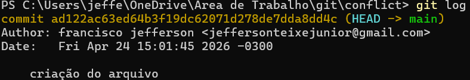
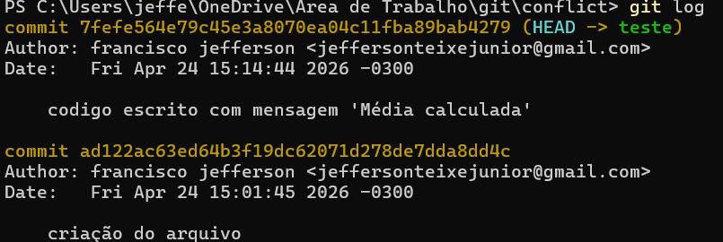
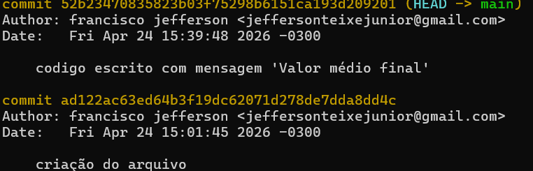
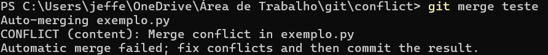
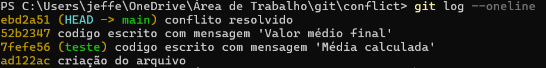

Seu material já está muito bom — o problema não é “evitar conflitos no GitHub” no texto em si, e sim pequenos pontos que podem causar confusão ou inconsistência (principalmente marcações, exemplos quebrados e trechos ambíguos). Eu revisei tudo e deixei:

* Markdown limpo e consistente
* Blocos de código corrigidos
* Comentários HTML removidos onde não fazem sentido
* Estrutura mais segura para renderização no GitHub
* Pequenas melhorias de clareza técnica

Aqui está a versão pronta para colar no GitHub 👇

---

# Resolução de Conflitos
<!-- Este arquivo ensina como identificar, entender e resolver conflitos de merge no Git -->

## 📋 Objetivos de Aprendizagem

Ao final deste módulo, você será capaz de:

- Entender o que é e por que ocorre um conflito de merge
- Identificar arquivos com conflito usando `git status` e `git diff`
- Ler e interpretar os marcadores de conflito inseridos pelo Git
- Resolver conflitos manualmente e com ferramentas visuais
- Completar um merge após a resolução
- Abortar um merge quando necessário
- Adotar práticas que reduzem a frequência de conflitos

## 🎯 Introdução

Conflitos de merge são uma parte completamente normal do trabalho colaborativo com Git. Eles acontecem quando duas linhas de desenvolvimento divergem e o Git não consegue determinar automaticamente qual versão deve prevalecer.

Eles não são erros do sistema. São um aviso do Git:

Encontrar um conflito **não indica que você cometeu um erro**. Isso significa que você e outra pessoa trabalharam simultaneamente em partes interligadas do projeto, o que é exatamente o que os sistemas de controle de versão foram projetados para gerenciar. Considere cada desacordo como uma chance de aprimorar sua compreensão do código e de alinhar objetivos com sua equipe.

## O que São Conflitos de Merge?

De acordo com a [documentação oficial do Git](https://git-scm.com/docs/git-merge#_how_conflicts_are_presented), um conflito de merge ocorre quando duas ramificações (branches) modificam a mesma parte de um arquivo de maneiras diferentes e você tenta combiná-las com `git merge`. O Git interrompe o processo de merge e marca as regiões problemáticas diretamente no arquivo, aguardando que você resolva manualmente.

### Por que Conflitos Acontecem?

Esses quatro casos são situações clássicas de **conflito de merge no Git**. Aqui vai a explicação de cada causa de forma direta:

---

### 1. Duas pessoas editam a mesma linha em branches diferentes
Quando duas alterações atingem **exatamente a mesma linha**, o Git não tem como decidir qual versão é a correta.
➡️ Resultado: conflito, porque uma mudança sobrescreve a outra.

---

### 2. Mudanças em linhas muito próximas
Mesmo que não seja a mesma linha, o Git usa contexto (linhas ao redor) para aplicar o merge.
Se as alterações estão **muito próximas**, ele pode não conseguir encaixar automaticamente.
➡️ Resultado: conflito por ambiguidade estrutural.

---

### 3. Um deleta o arquivo e outro modifica
Aqui existe uma contradição direta:
- Um branch diz: “esse arquivo não deve existir”
- Outro diz: “esse arquivo foi alterado”
➡️ Resultado: o Git não sabe se mantém ou remove o arquivo.

---

### 4. Refatorações amplas
Mudanças grandes como:
- renomear funções
- mover blocos de código
- reorganizar arquivos

fazem o Git “perder o rastro” do código original.
➡️ Resultado: ele não consegue mapear corretamente o que mudou, gerando conflitos mesmo que a intenção não seja contraditória.

---

### Cenário Típico

```
Pessoa A                     Pessoa B
   |                            |
   |---edita linha 10           |
   |                            |---edita linha 10
   |                            |
   |---commit                   |---commit
   |                            |
   |---push → main              |---push → CONFLITO!
```

### O que está acontecendo?

- A **Pessoa A** altera a linha 10 e envia (`push`) para a branch principal.
- A **Pessoa B** também altera a mesma linha localmente, mas ainda não tem a versão atualizada do repositório.
- Quando a Pessoa B tenta fazer `push`, o Git detecta que o histórico mudou.

### Por que ocorre o conflito?

O Git identifica que:
- A mesma linha foi modificada de formas diferentes
- Não é possível decidir automaticamente qual versão deve prevalecer

➡️ Resultado: o Git bloqueia o `push` e exige um **merge manual**

---

### Como o Git mostra o conflito

```bash
<<<<<<< HEAD
código da Pessoa A
=======
código da Pessoa B
>>>>>>> branch-b
```
---

## Identificando Conflitos

### Git Avisa

Ao tentar fazer um merge que resulta em conflito, o Git exibe uma mensagem semelhante a:

```bash
$ git merge feature-branch
Auto-merging exemplo.py
CONFLICT (content): Merge conflict in exemplo.py
Automatic merge failed; fix conflicts and then commit the result.
```

O merge é **pausado** nesse ponto. Nenhum commit é criado automaticamente; você precisa resolver os conflitos e então finalizar.

### Comandos para Verificar

```bash
# Ver quais arquivos estão em conflito (aparecem como "both modified")
git status

# Ver as diferenças detalhadas, inclusive os marcadores de conflito
git diff
```

A saída de `git status` durante um merge com conflito mostra os arquivos problemáticos na seção **"Unmerged paths"**.

## Anatomia de um Conflito

### Marcadores de Conflito

Quando o Git detecta um conflito, ele edita o arquivo afetado inserindo marcadores especiais:

```
<<<<<<< HEAD
Seu código (versão atual)
======
Código do outro branch
>>>>>> nome-do-branch
```

### Entendendo Cada Parte

- `<<<<<<< HEAD`: marca o início do bloco com o conteúdo do seu branch atual (HEAD)
- `=======`: separador entre as duas versões conflitantes
- `>>>>>>> nome-do-branch`: marca o fim do bloco com o conteúdo do branch que está sendo mesclado
> **Atenção:** todo o trecho entre `<<<<<<<` e `>>>>>>>`, incluindo os próprios marcadores, deve ser substituído pelo resultado final desejado.

### Exemplo Completo
Observação: esse exemplo assume que a branch principal se chama "main".

Crie um repositório com `git init`.

Crie um arquivo exemplo.py (isso vai variar de acordo com o sistema operacional)

#### Primeiro commit

Crie o primeiro commit

```bash
git add .
git commit -m "criação do arquivo"
```
O resultado do `git log` deve ser dessa forma(mudando o autor):


#### Criando Commit em Outra Branch

Crie outra branch

```bash
git switch -c teste
```

Deve ter o mesmo commit que a main(ou master).

Insira o código em exemplo.py:

```python
def calcular_media(valores):
    total = 0
    for v in valores:
        total += v

    print("Processando valores...")
    media = total / len(valores)

    # Linha 10 (diferença aqui)
    resultado = f"Média calculada: {media}"

    return resultado


dados = [10, 20, 30]
print(calcular_media(dados))
```

Crie um novo commit:


```bash
git commit -am "mensagem média calculada"
```



#### Criando o Segundo Commit em main

Volte para a main

```bash
git switch main
```

Troque o código de exemplo.py para esse (mesmo código com uma diferença na linha 10):

```python
def calcular_media(valores):
    total = 0
    for v in valores:
        total += v

    print("Processando valores...")
    media = total / len(valores)

    # Linha 10 (diferença aqui)
    resultado = f"Valor médio final: {media}"

    return resultado


dados = [10, 20, 30]
print(calcular_media(dados))
```

Crie um novo commit:

```bash
git commit -am "mensagem valor médio final"
```



#### Fazendo o Merge e Resolvendo o Conflito

Tenha certeza de que está na main.

```bash
git merge teste
```

Vai aparecer a mensagem de conflito:



e o arquivo terá na linha 10 onde houve conflito.

```python
// <<<<<<< HEAD
    resultado = f"Média calculada: {media}"
// =======
    resultado = f"Valor médio final: {media}"
// >>>>>>> teste
```

troque para (não esquecendo a identação):

```python
    resultado = f"Média: {media}"
```

e faça um commit para resolver o conflito:

```bash
git add .
git commit -m "conflito resolvido"

git log --graph --oneline
```



Se tentar fazer um `git merge teste`, irá retornar "Already up to date".
// >>>>>>> main

## Resolvendo Conflitos Manualmente

### Passo a Passo

#### 1. Identificar Arquivos com Conflito

```bash
# git status lista os arquivos conflitantes em "Unmerged paths"
git status
```

#### 2. Abrir Arquivo no Editor

Abra cada arquivo listado como conflitante no editor de sua preferência (VS Code, Vim, Nano, etc.). Todos os conflitos do arquivo estarão marcados com os delimitadores `<<<<<<<`, `=======` e `>>>>>>>`.

#### 3. Analisar as Versões

Antes de editar, leia com atenção **ambas** as versões. Se necessário, use `git log` para entender o contexto de cada mudança:

```bash
git log --oneline --graph --all
```

#### 4. Decidir o que Manter

- Manter apenas sua versão (HEAD)
- Manter apenas a versão do outro branch
- Combinar ambas as versões em um resultado que preserve as intenções de cada lado
- Escrever algo completamente novo, caso nenhuma das versões seja adequada
#### 5. Editar o Arquivo

Substitua todo o bloco de conflito — dos marcadores `<<<<<<<` até `>>>>>>>` — pelo conteúdo final desejado. Exemplo de resolução por combinação:

```markdown
# Resolução: Combinar ambas as versões
## Introdução ao Git

Git é um sistema de controle de versão distribuído, criado em 2005,
e muito popular para versionamento de código.
```

#### 6. Remover TODOS os Marcadores

Certifique-se de que não restou nenhuma linha com `<<<<<<<`, `=======` ou `>>>>>>>` no arquivo. Deixar esses marcadores no código fará com que ele fique inválido ou quebre em tempo de execução.

#### 7. Testar

Antes de marcar o conflito como resolvido, execute o código ou verifique a renderização do documento para confirmar que o resultado final está correto.

#### 8. Marcar como Resolvido

```bash
# Adicionar o arquivo ao index indica ao Git que o conflito foi resolvido
git add arquivo-resolvido.md
```

#### 9. Completar o Merge

```bash
# Finaliza o merge com um commit
git commit -m "resolve: merge de feature X"
```

Se o Git estiver configurado para abrir um editor de mensagem de commit automaticamente, você pode simplesmente salvar e fechar para aceitar a mensagem padrão gerada.

## Estratégias de Resolução

### Aceitar Completamente Uma Versão

Quando você sabe com certeza que quer descartar um dos lados, o Git oferece atalhos:

```bash
# Aceitar a versão do seu branch atual (HEAD) para o arquivo
git checkout --ours arquivo.md

# Aceitar a versão do branch que está sendo mesclado
git checkout --theirs arquivo.md
```

Após usar um desses comandos, ainda é necessário executar `git add arquivo.md` para marcar o conflito como resolvido.

### Combinar Mudanças

Quando ambas as versões contêm informações válidas e complementares, edite o arquivo manualmente para preservar o que faz sentido de cada lado. Essa é a abordagem mais comum em conflitos de código.

### Reescrever

Quando nenhuma das versões for apropriada, como após uma refatoração substancial, redija o trecho do início, eliminando todos os marcadores e gerando um resultado que cumpra o propósito de ambas as alterações.

## Ferramentas de Merge

### Editor de Texto

A resolução manual em qualquer editor de texto é sempre uma opção válida. Basta localizar os marcadores, entender as duas versões e escrever o resultado final.

### VS Code

O VS Code oferece suporte nativo a conflitos de merge. Ao abrir um arquivo conflitante, ele exibe botões inline acima de cada bloco:

- **Accept Current Change** — mantém a versão do HEAD
- **Accept Incoming Change** — mantém a versão do branch mesclado
- **Accept Both Changes** — insere as duas versões em sequência
- **Compare Changes** — abre uma visualização lado a lado
### Git GUI Tools

#### GitKraken

O GitKraken exibe os conflitos em um painel de merge com três colunas: versão local (esquerda), resultado final (centro) e versão remota (direita). Você pode clicar em trechos de qualquer lado para compor o resultado.

#### SourceTree

O SourceTree possui uma opção "Resolve Conflicts" no menu de contexto de cada arquivo conflitante, permitindo escolher entre a versão local, a versão remota ou abrir a ferramenta de merge configurada.

### git mergetool

```bash
# Abre a ferramenta de merge configurada para cada arquivo conflitante
git mergetool
```

### Configurando Merge Tool

```bash
# Usar o Vimdiff como ferramenta padrão
git config --global merge.tool vimdiff

# Usar o Meld (recomendado para iniciantes — interface gráfica)
git config --global merge.tool meld
```

Outras ferramentas suportadas incluem `kdiff3`, `opendiff` e `bc` (Beyond Compare). Consulte `git mergetool --tool-help` para ver todas as opções disponíveis no seu sistema.

## Tipos de Conflitos

### Conflito de Conteúdo

O mais comum. Ocorre quando duas branches modificam as mesmas linhas (ou linhas adjacentes) de um arquivo. O Git insere os marcadores `<<<<<<<` / `=======` / `>>>>>>>` no arquivo afetado.

### Conflito de Renomeação

Ocorre quando um arquivo é renomeado em uma branch e modificado (ou renomeado de forma diferente) em outra. O Git reporta algo como:

```
CONFLICT (rename/rename): Rename "a.txt"->"b.txt" in branch-A,
rename "a.txt"->"c.txt" in branch-B
```

Nesses casos, você precisa decidir qual nome (e conteúdo) deve prevalecer.

### Conflito de Deleção

Ocorre quando um branch deleta um arquivo enquanto o outro branch o modifica:

```
CONFLICT (modify/delete): arquivo.txt deleted in feature and
modified in main. Version main of arquivo.txt left in tree.
```

Você precisa decidir se mantém o arquivo (com qual versão) ou confirma a deleção.

### Conflito de Estrutura

Acontece quando há alterações incompatíveis na organização dos diretórios, como, por exemplo, transferir um arquivo para pastas distintas em cada branch. O Git informa sobre conflitos de "rename" ou "directory/file", podendo demandar uma resolução manual por meio da linha de comando.

## Prevenindo Conflitos

### Comunicação

Notifique sua equipe antes de implementar alterações significativas ou que impactem arquivos centrais. Utilize problemas, pull requests em rascunho ou mensagens no canal da equipe para organizar quem está trabalhando em qual tarefa.

### Pull/Fetch Frequente

Mantenha seu branch atualizado com frequência para reduzir a divergência acumulada:

```bash
# Baixar atualizações sem fazer merge automaticamente
git fetch origin

# Integrar as atualizações do branch principal ao seu branch atual
git merge origin/main
```

### Commits Pequenos e Frequentes

Commits menores e mais frequentes reduzem a quantidade de código alterado de uma vez, o que diminui a área de sobreposição com o trabalho de outros colaboradores.

### Dividir Trabalho

Sempre que possível, divida o trabalho entre partes distintas do código (módulos, arquivos, funcionalidades separadas). A probabilidade de conflito é muito menor quando cada pessoa trabalha em arquivos diferentes.

### Feature Flags

Evite branches de longa duração usando feature flags, técnica que permite integrar código ao branch principal mesmo antes de uma funcionalidade estar completa, controlando sua ativação via configuração. Quanto mais curto o ciclo de vida de um branch, menos divergência acumula.

## Resolvendo Conflitos em Pull Requests

### Conflitos no GitHub

Quando um pull request contém conflitos com o branch de destino, o GitHub exibe uma mensagem de aviso na página do PR: *"This branch has conflicts that must be resolved"*. O merge só pode ser concluído após a resolução.

### Método 1: Resolver Localmente

```bash
# 1. Baixar as atualizações do repositório remoto
git fetch origin

# 2. Integrar o branch principal ao seu branch
git merge origin/main

# 3. Resolver os conflitos nos arquivos marcados (editar, testar, git add)

# 4. Finalizar o merge
git commit -m "resolve conflitos com main"

# 5. Enviar o branch atualizado ao repositório remoto
git push origin meu-branch
```

### Método 2: GitHub Interface

Para conflitos simples (poucos arquivos, poucas linhas), o GitHub oferece um editor de conflitos diretamente na interface web. Clique em **"Resolve conflicts"** no PR, edite os blocos marcados, clique em **"Mark as resolved"** para cada arquivo e depois em **"Commit merge"**.

> A interface web do GitHub não está disponível para conflitos em arquivos binários ou conflitos de renomeação, nesses casos, use o Método 1

### Atualizar Branch com Main

Para manter um PR atualizado e evitar conflitos futuros, integre o branch principal ao seu branch regularmente:

```bash
git fetch origin
git merge origin/main
git push origin meu-branch
```

## Abortando um Merge

### Quando Abortar

Use `git merge --abort` quando perceber que iniciou o merge por engano, quando os conflitos são mais complexos do que o esperado e você precisa de mais contexto antes de prosseguir, ou quando quiser recomeçar a resolução do zero.

### Como Abortar

```bash
# Cancela o merge em andamento e restaura o estado anterior
git merge --abort
```

### Efeito

Conforme a [documentação oficial](https://git-scm.com/docs/git-merge#Documentation/git-merge.txt---abort), `git merge --abort` interrompe o processo de merge e tenta reconstruir o estado pré-merge. O comando só funciona enquanto o merge está em andamento (ou seja, antes do commit de merge ser criado). Se houver mudanças não commitadas no working tree antes do merge, `git merge --abort` pode não conseguir reconstruir o estado original.

## Conflitos Complexos

### Múltiplos Arquivos

Resolva um arquivo por vez. Use `git status` para ver a lista completa de arquivos conflitantes e vá marcando cada um como resolvido com `git add` após a edição. Só faça o commit final quando **todos** os arquivos estiverem resolvidos.

### Conflitos Grandes

Quando há muitos conflitos, pode ser útil:

1. Usar `git log --merge` para ver apenas os commits que causaram os conflitos
2. Usar `git diff --diff-filter=U` para listar somente os arquivos ainda não resolvidos
3. Considerar uma abordagem de rebase interativo (`git rebase -i`) para replay dos commits um por um, resolvendo conflitos incrementalmente
### Quando Pedir Ajuda

Não hesite em pedir ajuda ao autor do código conflitante, a um colega mais experiente ou ao professor. Resolver um conflito sem entender o contexto de ambas as mudanças pode introduzir bugs silenciosos. Comunicar-se é parte do processo.

## Exemplos Práticos

### Exemplo 1: Conflito Simples

```
Cenário:
- Você edita README linha 5
- Colega edita README linha 5
- Colega faz merge primeiro
- Você tenta merge → conflito
```

```bash
# 1. Verificar o conflito
git status

# 2. Abrir o README.md e localizar os marcadores
# <<<<<<< HEAD
# Sua versão
# =======
# Versão do colega
# >>>>>>> branch-do-colega

# 3. Editar o arquivo (remover marcadores e definir versão final)

# 4. Marcar como resolvido
git add README.md

# 5. Finalizar
git commit -m "resolve conflito no README"
```

---

### Exemplo 2: Conflito em Múltiplos Arquivos

Quando vários arquivos estão em conflito, organize a resolução por prioridade ou dependência lógica. Resolva primeiro arquivos que outros dependem (ex: arquivos de configuração, módulos compartilhados). Use `git status` após cada `git add` para acompanhar o progresso.

```
Cenário:
- Você altera config.json e app.py
- Colega altera os mesmos arquivos
- Conflitos em múltiplos arquivos
```

```bash
# 1. Ver arquivos com conflito
git status

# 2. Resolver primeiro config.json
# (remover marcadores manualmente)
git add config.json

# 3. Verificar progresso
git status

# 4. Resolver app.py
git add app.py

# 5. Finalizar merge
git commit -m "resolve conflitos em múltiplos arquivos"
```


---

### Exemplo 3: Conflito de Código

Em conflitos de código, **sempre teste** após a resolução antes de fazer o commit. Erros lógicos introduzidos na resolução (ex: chamar uma função com a assinatura errada de um dos lados) não serão detectados pelo Git — apenas pelos testes e pela execução.

```
Cenário:
- Você renomeia função para process_data_v2
- Colega corrige bug em process_data
- Código final fica inconsistente
```

```bash
# 1. Identificar conflito
git status

# 2. Código com conflito
# <<<<<<< HEAD
# def process_data_v2(data):
# =======
# def process_data(data):
# >>>>>>> main

# 3. Resolver mantendo nome novo + correção
# def process_data_v2(data):

# 4. Testar antes de confirmar
python main.py

# 5. Finalizar
git add main.py
git commit -m "resolve conflito de lógica"
```

## Dicas e Truques

### Usar Git Log para Contexto

```bash
# Ver o histórico dos dois branches envolvidos no merge
git log --oneline --graph --all

# Ver apenas os commits que introduziram o conflito
git log --merge
```

### Git Diff para Ver Mudanças

```bash
# Ver todas as diferenças pendentes (incluindo marcadores de conflito)
git diff

# Ver diferenças de um arquivo específico
git diff exemplo.py

# Comparar diretamente os dois branches antes de fazer o merge
git diff main..feature-branch
```

### Git Blame para Rastrear

```bash
# Ver quem alterou cada linha do arquivo e em qual commit
git blame arquivo.md

# Ver o blame de um intervalo de linhas específico
git blame -L 5,15 arquivo.md
```

### Comunicar com o Autor

Antes de descartar a versão de um colega, pergunte sobre a intenção das mudanças. O que parece redundante pode ser uma correção importante. Uma conversa rápida evita regressões.

## Fluxo de Trabalho Anti-Conflito

1. Execute `git fetch origin` regularmente para se manter atualizado com o repositório remoto
2. Faça `git merge origin/main` no seu branch com frequência — não espere o PR ficar grande para integrar
3. Prefira pull requests pequenos e focados em uma única mudança
4. Comunique à equipe quando for alterar arquivos de uso amplo (configurações, módulos centrais)
5. Use feature flags para integrar código incompleto ao branch principal sem ativá-lo em produção, evitando branches de longa duração

## Erros Comuns

### Erro 1: Não Remover Marcadores

Commitar um arquivo que ainda contém `<<<<<<<`, `=======` ou `>>>>>>>` é um dos erros mais comuns. O resultado é código inválido em produção. Sempre revise o arquivo inteiro antes de `git add`.

### Erro 2: Marcar como Resolvido Sem Testar

Executar `git add` e `git commit` sem testar o resultado pode introduzir bugs. Conflitos resolvidos incorretamente passam despercebidos pelo Git — apenas a execução ou os testes revelam o problema.

### Erro 3: Aceitar Mudanças Sem Entender

Usar `git checkout --theirs` ou `--ours` sem entender o conteúdo pode descartar trabalho válido. Sempre leia e compreenda **ambas** as versões antes de decidir.

### Erro 4: Fazer Force Push

`git push --force` em branches compartilhadas sobrescreve o histórico remoto, descartando commits de outros colaboradores. Use `git push --force-with-lease` se necessário — ele verifica se ninguém mais atualizou o branch desde o seu último fetch antes de aceitar o push.

## Conflitos em Diferentes Arquivos

### Markdown

Conflitos em documentação geralmente são os mais fáceis de resolver, pois não há risco de quebrar o código. Combine as versões preservando o sentido de ambas as contribuições.

### Código

Requer atenção redobrada. Após resolver, execute os testes automatizados. Verifique se funções renomeadas, parâmetros alterados ou imports movidos estão consistentes com o restante do código.

### JSON/YAML

Arquivos de configuração são sensíveis a formatação. Após resolver, valide o arquivo com uma ferramenta como `python -m json.tool config.json` (JSON) ou `python -m py_compile` / um linter de YAML, para garantir que a sintaxe está correta.

### Binários

O Git não consegue fazer merge de arquivos binários (imagens, PDFs, etc.). Você deve escolher uma das versões:

```bash
# Aceitar a versão do seu branch
git checkout --ours imagem.png

# Aceitar a versão do branch que está sendo mesclado
git checkout --theirs imagem.png

git add imagem.png
```

## Exercícios

1. **Conflito intencional:** Crie um repositório, crie dois branches, edite a mesma linha nos dois e faça o merge. Resolva o conflito manualmente.
2. **Conflito simulado em múltiplos arquivos:** Repita o exercício anterior, mas editando dois arquivos diferentes em cada branch.
3. **Usar mergetool:** Configure o `git mergetool` com uma ferramenta de sua escolha e use-a para resolver um conflito.
4. **Conflito em Pull Request:** No GitHub, crie um PR com conflito e resolva-o usando a interface web e, em seguida, o método local.

## Checklist de Resolução


- [ ] Identificar arquivos em conflito
- [ ] Entender ambas as versões
- [ ] Decidir abordagem
- [ ] Editar arquivo
- [ ] Remover marcadores
- [ ] Testar mudanças
- [ ] git add
- [ ] git commit
- [ ] Verificar que tudo funciona

## Recursos Adicionais

- [Git Merge — Documentação Oficial](https://git-scm.com/docs/git-merge#_how_conflicts_are_presented)
- [Git Merge Strategies — git-scm.com](https://git-scm.com/docs/merge-strategies)
- [GitHub — Resolving a merge conflict using the command line](https://docs.github.com/en/pull-requests/collaborating-with-pull-requests/addressing-merge-conflicts/resolving-a-merge-conflict-using-the-command-line)
- [GitHub — Resolving a merge conflict on GitHub](https://docs.github.com/en/pull-requests/collaborating-with-pull-requests/addressing-merge-conflicts/resolving-a-merge-conflict-on-github)
- [Git Book — Basic Branching and Merging](https://git-scm.com/book/en/v2/Git-Branching-Basic-Branching-and-Merging)

## Resumo

Conflitos de merge são o mecanismo do Git para sinalizar que ele precisa da sua ajuda para integrar mudanças concorrentes. O processo de resolução segue sempre o mesmo fluxo: identificar → entender → editar → testar → `git add` → `git commit`. Com prática, a resolução se torna rápida e natural.

### Lembre-se

- Conflitos são normais
- Não tenha medo
- Entenda ambas as versões
- Teste antes de finalizar
- Peça ajuda se precisar

---

## 👥 Contribuidores

* @bigauke (Antonio Daniel de Souza Linhares)

---

<!-- Este conteúdo é colaborativo. Contribuidores deste arquivo: -->
<!-- Adicione seu nome quando contribuir: -->
- [@brunotakazono](https://github.com/brunotakazono) - Seção 6