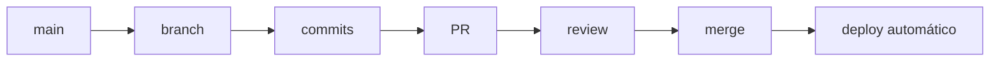

# Workflows no GitHub

<!-- Este arquivo explica diferentes workflows e recursos do GitHub -->

## 📋 Objetivos de Aprendizagem

Ao final deste capítulo, você será capaz de:
- Entender e aplicar diferentes fluxos de trabalho (workflows) como GitHub Flow e Git Flow.
- Contribuir para projetos Open Source utilizando o Fork Workflow.
- Gerenciar tarefas e projetos usando Issues e GitHub Projects.
- Compreender o básico de automação com GitHub Actions e hospedagem com GitHub Pages.
- Configurar proteções de branch e garantir a segurança do seu código.

## 🎯 Introdução

O GitHub é muito mais do que apenas um "pendrive na nuvem" para hospedar seu código. Hoje, ele é uma plataforma completa de colaboração, gestão de projetos, automação de tarefas (CI/CD) e segurança. Entender os recursos e os fluxos de trabalho que o GitHub oferece é o que separa um programador que apenas "salva código" de um engenheiro de software que sabe trabalhar em alto nível.

## O que é um Workflow?

No contexto do Git e GitHub, um *workflow* (fluxo de trabalho) é um conjunto de práticas, regras e processos padronizados que uma equipe adota para colaborar no mesmo código. Ele define como as branches são criadas, como as revisões são feitas e como o código chega até a produção. Não existe um "workflow perfeito", mas sim o mais adequado para o tamanho e a maturidade do seu projeto.

## Fork Workflow

### O que é Fork?

Fazer um "Fork" é criar uma cópia exata de um repositório de outra pessoa ou organização diretamente na sua conta do GitHub. Essa cópia é sua, e você tem permissão total (inclusive administrativa) sobre ela, sem afetar o projeto original.

### Quando Usar

É o padrão ouro para **projetos Open Source** e contribuições externas. Como você não tem permissão de escrita (push) no repositório de grandes projetos (como o React, Linux ou VS Code), você faz um fork, trabalha na sua cópia e depois pede que eles puxem suas alterações.

### Passo a Passo

#### 1. Fork do Repositório

Vá até a página do repositório original no GitHub e clique no botão "Fork" no canto superior direito. Selecione a sua conta pessoal.

#### 2. Clone do Fork

Baixe a SUA cópia para o seu computador:

```bash
git clone https://github.com/SEU-USUARIO/nome-do-repo.git
cd nome-do-repo
```

#### 3. Configurar Upstream

Você precisa vincular o seu repositório local ao repositório original (chamado de `upstream`) para poder baixar atualizações que outras pessoas fizerem lá.

```bash
git remote add upstream https://github.com/DONO-ORIGINAL/nome-do-repo.git
```

#### 4. Criar Branch

```bash
git switch -c feature/minha-contribuicao
```

#### 5. Fazer Mudanças e Commit

```bash
git add .
git commit -m "feat: adiciona nova funcionalidade incrível"
```

#### 6. Push para Fork

Envie a branch para o SEU fork no GitHub:

```bash
git push -u origin feature/minha-contribuicao
```

#### 7. Abrir Pull Request

Vá até o GitHub (na página do repositório original ou do seu fork) e abra um Pull Request. O GitHub entenderá automaticamente que você quer enviar código do seu fork para o projeto principal.

#### 8. Manter Fork Atualizado

Antes de começar um novo trabalho, sempre atualize a sua cópia local com as novidades do projeto original:

```bash
# Baixa as novidades do original
git fetch upstream

# Traz as novidades para a sua branch main local
git switch main
git merge upstream/main
```

### Vantagens

- **Segurança:** Ninguém mexe diretamente no repositório original sem revisão.
- **Experimentação:** Você pode quebrar o seu fork à vontade.
- **Escalabilidade:** Permite que milhares de pessoas contribuam para um projeto simultaneamente.

## GitHub Flow

### O que é

É um workflow leve, simples e ágil, criado pelo próprio GitHub. Ele foca na entrega contínua (deploy constante).

### Princípios

1. A branch `main` está **sempre** pronta para ir para produção (deployável).
2. Todo trabalho novo acontece em uma branch descritiva criada a partir da `main`.
3. Abre-se um Pull Request o mais cedo possível para iniciar a discussão, mesmo se o código não estiver finalizado.
4. Após o PR ser aprovado, ele é mesclado (merge) na `main` e imediatamente enviado para produção (deploy).

### Fluxo Completo



### Quando Usar

Ideal para a maioria dos projetos web modernos, startups, times ágeis e projetos onde você pode fazer dezenas de atualizações por dia sem impactar negativamente os usuários (SaaS, sites, APIs).

## Git Flow

### O que é

É um workflow clássico, rigoroso e altamente estruturado, criado por Vincent Driessen. Ele define papéis estritos para diferentes branches e foca no lançamento de "versões" pontuais do software.

### Branches Principais

#### main (ou master)

Contém apenas o código que está rodando em produção atualmente. Cada commit na `main` deve ser acompanhado de uma tag de versão (ex: `v1.2.0`).

#### develop

É a branch onde a equipe de desenvolvimento integra as funcionalidades para o próximo lançamento. É a "main" do dia a dia dos desenvolvedores.

### Branches de Suporte

#### feature/*

Criadas a partir da `develop`. Servem para desenvolver novas funcionalidades. Quando prontas, voltam para a `develop`.

#### release/*

Criadas a partir da `develop` quando há funcionalidades suficientes para um novo lançamento. Aqui só se faz correção de bugs finais e ajustes de versão. Quando pronta, vai para a `main` (produção) e volta para a `develop`.

#### hotfix/*

Criadas a partir da `main`. Servem para corrigir um erro crítico que está acontecendo em produção agora. Após a correção, a hotfix vai para a `main` e também volta para a `develop` para que o erro não volte na próxima versão.

### Fluxo Visual

Imagine duas linhas centrais grossas (`main` e `develop`) que correm paralelamente, com `features` saindo e voltando da `develop`, `releases` fazendo a ponte entre `develop` e `main`, e `hotfixes` agindo como curativos de emergência na `main`.

### Quando Usar

Projetos que possuem ciclos de lançamento longos e planejados, como aplicativos de celular (iOS/Android), jogos, software instalado no computador (desktop apps) ou sistemas de bancos, onde não se pode simplesmente "atualizar o site" a qualquer minuto.

## Trunk-Based Development

### O que é

Um workflow onde todos os desenvolvedores fazem commits diretos (ou PRs minúsculos que duram poucas horas) em uma única branch principal (o "tronco" ou *trunk* - geralmente a `main`). 

### Características

- Quase não existem branches de vida longa.
- Exige forte uso de **Feature Flags** (botões de liga/desliga no código) para esconder código que ainda não está pronto dos usuários em produção.
- Depende de uma suíte de testes automatizados impecável.

### Quando Usar

Equipes sêniores altamente maduras e disciplinadas que possuem processos de CI/CD (Integração e Entrega Contínuas) extremamente confiáveis. (Google, Facebook e Netflix operam de forma similar a isso).

## Issues

### O que São Issues

Issues são o sistema oficial do GitHub para rastreamento de ideias, tarefas, bugs e planejamento. Elas substituem ferramentas externas como Jira ou Trello para gerenciamento de engenharia focado no código.

### Tipos de Issues

Uma issue pode ser um relato de um botão quebrado, um pedido para criar um novo sistema de login, uma dúvida sobre a documentação ou um aviso de vulnerabilidade.

### Criando Issues

Uma boa issue tem um título claro, uma descrição detalhada (passo a passo para reproduzir o bug, se for o caso), e está atribuída a responsáveis.

### Templates de Issues

Você pode criar a pasta `.github/ISSUE_TEMPLATE/` no seu projeto com arquivos em Markdown (`bug_report.md`, `feature_request.md`). Quando alguém for criar uma issue, o GitHub oferecerá esses formulários pré-preenchidos.

### Labels (Etiquetas)

Labels organizam visualmente e filtram as issues e Pull Requests.

#### Labels Comuns

- `bug`: Algo não está funcionando conforme o esperado. (Geralmente vermelha).
- `enhancement`: Uma melhoria ou nova funcionalidade.
- `documentation`: Questões relacionadas ao README ou Wiki.
- `good first issue`: Ideal para recém-chegados ao projeto que querem contribuir e não sabem por onde começar.
- `help wanted`: Os mantenedores precisam de ajuda da comunidade com isso.

### Milestones (Marcos)

Agrupam issues e PRs que pertencem a um mesmo objetivo ou versão. Por exemplo, o Milestone "Versão 2.0" só atinge 100% quando todas as issues vinculadas a ele forem fechadas.

### Assignees

Atribuir responsáveis (assignees) deixa claro quem está trabalhando na tarefa, evitando que duas pessoas tentem resolver o mesmo bug sem saberem uma da outra.

### Linking Issues e PRs

Se você mencionar `Closes #12` ou `Fixes #12` na descrição de um Pull Request, o GitHub fechará a Issue de número 12 automaticamente no momento em que o seu PR for aceito (merge).

## Projects (GitHub Projects)

### GitHub Projects

É uma ferramenta de gestão de projetos poderosa embutida no GitHub, funcionando como um Kanban (estilo Trello/Jira), mas profundamente conectada ao seu código.

### Criando um Project

Vá na aba "Projects" da sua organização ou perfil, clique em "New project". 

### Colunas Clássicas

O fluxo padrão geralmente é:
- **To Do** (A fazer)
- **In Progress** (Em andamento)
- **In Review** (Em revisão / PR aberto)
- **Done** (Concluído)

### Automatização

Você pode configurar o GitHub Projects para mover os cartões sozinhos. Por exemplo, quando você abre um PR vinculado a uma issue, o cartão da issue move para "In Review". Quando faz o merge, move para "Done".

### Views

O GitHub Projects moderno permite visualizar as mesmas tarefas como um Quadro (Board Kanban), uma Tabela (estilo Excel) ou um Roadmap (gráfico de Gantt no tempo).

## GitHub Actions

### O que São Actions

O GitHub Actions é a ferramenta de CI/CD (Integração Contínua e Entrega Contínua) do GitHub. Ele permite que você crie scripts automatizados que rodam em servidores do GitHub sempre que algo acontece no seu repositório.

### Casos de Uso

- Rodar testes automatizados toda vez que alguém abre um PR.
- Fazer deploy (publicação) do seu site em um servidor automaticamente quando um código entra na `main`.
- Mandar uma mensagem no Slack do time avisando que uma issue foi criada.
- Checar se o código está bem formatado (Linting).

### Workflow File

Os workflows são definidos em arquivos `.yml` (YAML) dentro da pasta `.github/workflows/`.

### Eventos (Triggers)

Os gatilhos definem QUANDO a automação vai rodar.
`on: push` (toda vez que tem um push)
`on: pull_request` (toda vez que tem um PR)
`on: schedule` (tipo cron, roda todo dia às 8h)

### Exemplo: CI Básico

```yaml
# .github/workflows/testes.yml
name: Rodar Testes Node.js

on: [push, pull_request] # Quando vai rodar

jobs:
  test: # Nome do trabalho
    runs-on: ubuntu-latest # Máquina que o GitHub vai emprestar

    steps: # Passos a executar
    - uses: actions/checkout@v3 # Baixa o código do repositório
    - name: Usar Node.js
      uses: actions/setup-node@v3
      with:
        node-version: '18.x'
    - run: npm install # Instala dependências
    - run: npm test # Roda os testes
```

### Marketplace

Você não precisa escrever tudo do zero. A comunidade criou milhares de Actions prontas (como "Fazer deploy na AWS" ou "Enviar SMS") disponíveis no GitHub Marketplace.

## GitHub Pages

### O que é

É um serviço gratuito do GitHub que transforma o código do seu repositório em um site publicado na internet (`seu-usuario.github.io/nome-do-repo`). 

### Casos de Uso

Perfeito para hospedar sites estáticos (HTML/CSS/JS puros), portfolios, currículos online, documentação de bibliotecas e landing pages. Não roda linguagens de servidor (como PHP ou Node.js/Express).

### Habilitando Pages

Vá em **Settings > Pages**. Escolha a branch onde está o seu código fonte e clique em Save. Em alguns minutos seu site estará no ar.

### Fontes (Sources)

Você pode configurar o Pages para ler a raiz da sua branch `main`, apenas ler a pasta `/docs` da `main`, ou até mesmo ler uma branch especial chamada `gh-pages`.

### Jekyll

O GitHub Pages tem suporte nativo ao Jekyll, um gerador de sites estáticos escrito em Ruby, excelente para criar blogs suportados diretamente pelo Markdown do repositório.

### Custom Domain

Você pode comprar um domínio na internet (ex: `meuprojetofoda.com`) e configurá-lo no Settings do GitHub Pages para não ter que usar a URL padrão do GitHub. Ele até gera o certificado SSL (HTTPS) de graça.

## GitHub Discussions

### O que São

São fóruns de comunidade integrados ao repositório. Pense neles como o "Reddit" ou "Stack Overflow" do seu projeto.

### Diferença de Issues

- **Issues:** São para tarefas acionáveis e rastreáveis (Bugs e novas features). Quando a tarefa acaba, a issue fecha.
- **Discussions:** São para perguntas abertas, suporte à comunidade, anúncios, debates de arquitetura e compartilhamento de ideias. Podem ficar abertas para sempre.

## GitHub Wiki

### O que É

Cada repositório no GitHub possui uma aba "Wiki" que é, na verdade, um repositório Git separado feito exclusivamente para hospedar documentação longa.

### Quando Usar

Quando o `README.md` fica gigantesco e difícil de ler, é hora de mover a documentação pesada (guias de arquitetura, tutoriais passo a passo para usuários) para a Wiki do projeto.

## GitHub Gists

### O que São

O Gists (`gist.github.com`) é um serviço secundário do GitHub focado em compartilhar pequenos trechos de código (snippets), arquivos únicos ou anotações rápidas sem a necessidade de criar um repositório inteiro.

### Tipos

Gists podem ser **Públicos** (qualquer um pode achar buscando no Google) ou **Secretos** (não aparecem em buscas, apenas quem tem o link exato consegue acessar - útil para compartilhar código temporário com um colega).

## Code Owners

### Arquivo CODEOWNERS

Em projetos grandes, você pode criar um arquivo chamado `CODEOWNERS` na raiz (ou na pasta `.github/`). Ele define automaticamente quem são os responsáveis (reviewers) quando alguém tenta alterar determinados arquivos.

```text
# .github/CODEOWNERS
# Todos os arquivos markdown devem ser revisados pelo time de documentação
*.md @minha-org/time-de-documentacao

# Tudo na pasta de banco de dados deve ser aprovado pelo João
/src/database/ @joaosilva
```

## Branch Protection (Proteção de Branch)

### O que É

As regras de proteção impedem que usuários causem danos às branches principais (como a `main`). É a configuração mais importante para a segurança do time.

### Regras Comuns

- **Require pull request before merging:** Ninguém pode comitar diretamente na branch. Todo mundo precisa abrir PR.
- **Require approvals:** O PR só pode receber merge se tiver pelo menos X aprovações (Approve) de outros desenvolvedores no Code Review.
- **Require status checks to pass:** O PR só pode receber merge se as GitHub Actions (testes, linters) passarem e ficarem verdes.
- **Require conversation resolution:** Todos os comentários de review devem ser marcados como "resolvidos" antes do merge.
- **Restrict push:** Ninguém, nem mesmo os administradores, tem o direito de forçar o envio de histórico (Force Push) na branch principal.

### Configurando

Vá em **Settings > Branches > Add branch protection rule**. (Requer permissões de administrador do repositório).

## Security (Segurança)

### Dependabot

O GitHub possui um robô chamado Dependabot. Ele varre o seu projeto constantemente. Se ele descobrir que a biblioteca que você usa (ex: React, Django, etc) tem uma vulnerabilidade de segurança conhecida, ele abrirá um Pull Request sozinho no seu repositório sugerindo a atualização para a versão segura.

### Secret Scanning

O GitHub varre todo o código que sobe para a plataforma. Se você comitar um Token da AWS ou uma chave da API do Google, o GitHub detectará em segundos, alertará você e, em muitos casos, informará diretamente a empresa parceira para que ela invalide a sua chave automaticamente por segurança.

## Notifications

### Watching

Você pode controlar o nível de notificações que recebe de um repositório clicando no botão "Watch" no topo da tela:
- **Participating and @mentions:** Só recebe e-mail se marcarem seu nome ou comentarem nas suas issues. (Padrão e recomendado).
- **All Activity:** Recebe e-mail de absolutamente tudo (PRs, issues). Cuidado, isso lotará sua caixa de entrada em projetos grandes.
- **Ignore:** Silencia o repositório completamente.

## GitHub CLI (Ferramenta de Linha de Comando)

### Instalação

O GitHub construiu a ferramenta `gh` para que você possa fazer tudo o que o site faz, mas direto do terminal.
Para instalar no Windows (via winget): `winget install --id GitHub.cli`
Mac (Homebrew): `brew install gh`

### Comandos Úteis

```bash
# Faz o login autenticado via navegador
gh auth login

# Clona um repositório mais facilmente
gh repo clone organizacao/nome-projeto

# Cria um PR direto do terminal
gh pr create --title "Minha feature" --body "Detalhes"

# Vê todas as issues abertas
gh issue list
```

## Exemplos Práticos

### Exemplo 1: Contribuir para Open Source
1. Faça o Fork de uma biblioteca que você gosta.
2. Clone o Fork para o PC.
3. Crie uma branch, arrume um bug que você encontrou.
4. Faça o push e abra um Pull Request para a biblioteca original. 
5. Responda educadamente aos reviews dos mantenedores.

### Exemplo 2: Automatizar Testes com Actions
1. Crie o arquivo `.github/workflows/ci.yml`.
2. Configure o step para rodar `npm run test`.
3. Toda vez que você abrir um PR, o GitHub mostrará um sinal verde de que seu código está testado e seguro.

## Erros Comuns

1. **Não Atualizar o Fork:** Tentar abrir um PR com um código base que está dois meses atrasado em relação ao projeto original. Ocorrerão dezenas de conflitos. Use `git fetch upstream`.
2. **Main Desprotegida:** Ter um projeto comercial e esquecer de ligar a *Branch Protection* na `main`. É só questão de tempo até alguém fazer um Force Push por acidente e deletar o histórico do time.
3. **Não Configurar Notificações:** Perder conversas importantes no GitHub porque todos os e-mails estão indo para o spam, atrasando o trabalho da equipe inteira.

## Boas Práticas

- **Documente o Workflow:** O arquivo `CONTRIBUTING.md` do seu projeto deve explicar se vocês usam Git Flow, GitHub Flow, etc.
- **Automatize:** Deixe robôs (GitHub Actions) fazerem tarefas chatas de verificação e formatação. Humanos focam na lógica e arquitetura.
- **Feche as Issues:** Vincule sempre seus PRs a issues (`Closes #45`) para manter o painel limpo automaticamente.
- **Mantenha PRs Pequenos:** Workflow nenhum salva a equipe se os PRs levarem 3 semanas para serem feitos e mudarem 5 mil linhas de código de uma vez.

## Exercícios

1. Encontre um repositório Open Source público com a label `good first issue` no GitHub.
2. Realize o fluxo de **Fork Workflow** para esse repositório na sua máquina local.
3. Crie um repositório seu e habilite o **GitHub Projects** em formato de Kanban. Crie e arraste 3 issues.
4. Vá nas **Settings** do seu repositório pessoal e ative o **Branch Protection** na sua branch principal, exigindo PR.

## Recursos Adicionais

- [GitHub Flow Guide Oficial](https://docs.github.com/en/get-started/using-github/github-flow)
- [Documentação do GitHub Actions](https://docs.github.com/en/actions)
- [Guia Oficial do GitHub Pages](https://pages.github.com/)

## Resumo

- O **GitHub Flow** é excelente para agilidade contínua; o **Git Flow** serve para cronogramas de releases rigorosos.
- Use **Forks** quando não tiver permissão para mexer no repositório original.
- Organize o trabalho usando **Issues** (tarefas) e **Projects** (Kanban).
- Aumente a qualidade da engenharia automatizando processos com **GitHub Actions**.
- Proteja o trabalho da sua equipe habilitando regras de **Branch Protection**.


---

<div align="center">

[⬅️ Capítulo Anterior: 06. Resolução de Conflitos](./06-resolucao-conflitos.md)
 | 
[Capítulo Seguinte: 08. Ferramentas e Recursos ➡️](./08-ferramentas-e-recursos.md)

</div>

## 👥 Contribuidores

Este conteúdo é colaborativo. Contribuidores deste arquivo:
- [@bigauke](https://github.com/bigauke) (Antonio Daniel de Souza Linhares) - Preenchimento do conteúdo sobre Workflows e GitHub.