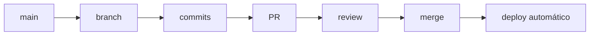

# Workflows no GitHub

<!-- Este arquivo explica diferentes workflows e recursos do GitHub -->

## 📋 Objetivos de Aprendizagem

Ao final deste módulo, você será capaz de:

- Entender os principais workflows de colaboração com Git e GitHub
- Escolher o workflow adequado para cada tipo de projeto
- Utilizar recursos como Issues, Projects, Actions e Pages
- Automatizar tarefas com GitHub Actions
- Publicar sites estáticos com GitHub Pages
- Proteger branches e gerenciar contribuições com segurança

## 🎯 Introdução

O GitHub vai muito além de simplesmente hospedar código. É uma **plataforma completa de colaboração e automação** que oferece ferramentas para gerenciar projetos, automatizar processos, publicar documentação e muito mais.

Conhecer os workflows e recursos disponíveis é fundamental para trabalhar de forma eficiente em equipe.

## O que é um Workflow?

Um **workflow de desenvolvimento** é um conjunto de práticas, convenções e processos que uma equipe adota para colaborar em um projeto de software. Ele define como o código é escrito, revisado, integrado e entregue.

Escolher um bom workflow ajuda a:
- Evitar conflitos de código
- Garantir qualidade com revisões
- Manter o histórico organizado
- Facilitar a integração contínua

## Fork Workflow

### O que é Fork?

Fork é uma **cópia completa de um repositório na sua conta do GitHub**. Você passa a ter controle total sobre essa cópia, podendo fazer alterações sem afetar o repositório original. É a base para contribuições em projetos open source.

### Quando Usar

- Contribuir para projetos **open source** sem acesso de escrita direto
- Experimentar mudanças sem risco ao projeto original
- Criar sua própria versão personalizada de um projeto
- Em disciplinas e cursos colaborativos (como este!)

### Passo a Passo

#### 1. Fork do Repositório

Acesse o repositório original no GitHub e clique no botão **"Fork"** no canto superior direito. Escolha sua conta como destino. O GitHub criará uma cópia em `https://github.com/SEU-USUARIO/repositorio`.

#### 2. Clone do Fork

Baixe a SUA cópia (o fork) para a sua máquina local:

```bash
git clone https://github.com/seu-usuario/nome-do-repo.git
cd nome-do-repo
```

#### 3. Configurar Upstream

Para manter seu fork atualizado com as mudanças que acontecem no projeto original, adicione o repositório original como um controle remoto chamado `upstream`:

```bash
git remote add upstream https://github.com/dono-original/nome-do-repo.git
```

#### 4. Criar Branch

Nunca trabalhe diretamente na branch `main`. Crie uma branch específica para a sua contribuição:

```bash
git switch -c feature/minha-contribuicao
```

#### 5. Fazer Mudanças e Commit

Faça suas alterações no código, adicione os arquivos e crie commits com mensagens claras:

```bash
git add .
git commit -m "feat: adiciona nova funcionalidade XYZ"
```

#### 6. Push para Fork

Envie a branch com as suas alterações para o SEU fork no GitHub:

```bash
git push origin feature/minha-contribuicao
```

#### 7. Abrir Pull Request

Vá até a página do repositório original no GitHub. Você verá um aviso sobre a sua nova branch com um botão **"Compare & pull request"**. Clique nele, preencha a descrição explicando o que você fez e submeta o PR para avaliação dos mantenedores.

#### 8. Manter Fork Atualizado

Antes de começar uma nova contribuição (ou se o seu PR estiver demorando), mantenha a sua branch `main` sincronizada com o projeto original:

```bash
# Baixa as novidades do repositório original
git fetch upstream

# Garante que você está na sua main
git switch main

# Atualiza a sua main local apenas se for possível avançar em fast-forward
git merge --ff-only upstream/main

# Atualiza o seu fork no GitHub
git push origin main
```

### Vantagens

- **Segurança:** Mantenedores do projeto original não precisam dar permissão de escrita para estranhos.
- **Experimentação Livre:** Você pode "quebrar" o seu fork à vontade sem medo de estragar o projeto principal.
- **Escalabilidade:** Permite que milhares de pessoas contribuam para um mesmo projeto de forma organizada.

## GitHub Flow

### O que é


GitHub Flow é um workflow de desenvolvimento **simples e ágil** criado pelo GitHub, ideal para projetos com deploy contínuo. Nesse fluxo, todas as mudanças partem da branch principal (`main`) e retornam para ela por meio de Pull Requests.

### Princípios

1. A `main` está **sempre pronta para deploy** — nunca quebre a branch principal
2. Use **branches curtas e descritivas** para cada tarefa ou funcionalidade
3. Abra **Pull Requests** cedo para discussão, feedback e revisão de código
4. Mudanças só entram na `main` após review e aprovação
5. Faça o **deploy imediatamente** após o merge na `main`


### Fluxo Completo


```mermaid
flowchart LR
    A[main] --> B[branch]
    B --> C[commits]
    C --> D[PR]
    D --> E[review]
    E --> F[merge]
    F --> G[deploy automático]
```

### Quando Usar


Ideal para projetos web com **deploy contínuo** ou **Continuous Deployment**, como SaaS, aplicações web e projetos que precisam de agilidade no desenvolvimento, especialmente em equipes pequenas ou médias.

### GitHub Flow vs Git Flow

- GitHub Flow é mais simples e direto
- Não possui branches de `release` ou `develop`
- É ideal para deploy contínuo
- Git Flow é mais estruturado e indicado para projetos com versões planejadas


## Git Flow

### O que é

Git Flow é um workflow **mais estruturado**, criado por Vincent Driessen, indicado para projetos com ciclos de release definidos. Utiliza múltiplas branches com papéis específicos.

### Branches Principais

#### main (ou master)

Contém o **código em produção**. Apenas código testado e aprovado chega aqui, geralmente via merge de `release` ou `hotfix`.

#### develop

Branch de **desenvolvimento ativo**. Todas as features são integradas aqui antes de ir para produção.

### Branches de Suporte

#### feature/*

Branches para **novas funcionalidades**. Partem de `develop` e são mescladas de volta em `develop` ao concluir. Ex: `feature/login-social`

#### release/*

Branches de **preparação de release**. Partem de `develop`, recebem apenas correções de bugs e são mescladas em `main` e `develop`. Ex: `release/v1.2.0`

#### hotfix/*

Branches para **correções urgentes em produção**. Partem de `main` e são mescladas em `main` e `develop`. Ex: `hotfix/corrige-login`

### Fluxo Visual

```
main     ─────────────────────────────────────► produção
           ↑ hotfix          ↑ release
develop  ──────────────────────────────────────
              ↑ feature   ↑ feature
```

### Quando Usar

Ideal para projetos com **releases planejadas** e versionamento semântico (v1.0, v2.1...), como bibliotecas, apps mobile e software corporativo.

### Ferramentas

A extensão `git-flow` automatiza o fluxo:
```bash
# Instalar (Linux/Mac)
brew install git-flow

# Iniciar git flow no projeto
git flow init

# Criar feature
git flow feature start minha-feature

# Finalizar feature
git flow feature finish minha-feature
```

## Trunk-Based Development

### O que é

Trunk-Based Development é um workflow onde **todos os desenvolvedores commitam frequentemente na branch principal** (`main`/`trunk`). Branches são curtíssimas (horas, não dias).

### Características

- **Integração contínua real**: código integrado várias vezes ao dia
- **Feature flags**: funcionalidades novas ficam ocultas até estarem prontas
- **Testes automatizados**: essenciais para garantir qualidade
- **Branches efêmeras**: vivem menos de 1 dia

### Quando Usar

Indicado para **equipes maduras** com cultura forte de testes, CI/CD bem estruturado e desenvolvedores experientes. Muito usado em grandes empresas como Google e Facebook.

## Issues

### O que São Issues

Issues são o **sistema de rastreamento de tarefas** do GitHub. Funcionam como um quadro de discussão para reportar bugs, sugerir funcionalidades, fazer perguntas e organizar o trabalho do projeto.

### Tipos de Issues

- **Bug**: algo não está funcionando corretamente
- **Feature**: solicitação de nova funcionalidade
- **Question**: dúvida ou pedido de esclarecimento
- **Documentation**: melhoria ou correção na documentação
- **Task**: tarefa de trabalho a ser realizada

### Criando Issues

Clique em **"New issue"** e preencha:
- **Título**: claro e objetivo (ex: `[BUG] Login falha com email inválido`)
- **Descrição**: contexto, passos para reproduzir, comportamento esperado
- **Labels**: categorize a issue
- **Assignees**: atribua responsáveis
- **Milestone**: vincule a um objetivo/sprint

### Templates de Issues

Crie templates em `.github/ISSUE_TEMPLATE/` para padronizar a abertura de issues. O GitHub oferece templates prontos para bug reports e feature requests, ou você pode criar os seus.

### Labels (Etiquetas)

Labels são **etiquetas coloridas** que categorizam e filtram issues e PRs. Facilite muito a organização e a busca de itens por tipo, prioridade ou status.

#### Labels Comuns

- `bug` - Algo não está funcionando
- `enhancement` - Nova funcionalidade ou melhoria
- `documentation` - Melhorias na documentação
- `good first issue` - Bom para iniciantes no projeto
- `help wanted` - Precisa de ajuda da comunidade
- `wontfix` - Não será corrigido/implementado

### Milestones (Marcos)

Milestones **agrupam issues por objetivo ou release**. Permitem acompanhar o progresso de uma versão ou sprint, mostrando quantas issues estão abertas/fechadas para aquele marco.

### Assignees

Assignees são os **responsáveis por uma issue ou PR**. Um item pode ter múltiplos assignees. Aparece no perfil da pessoa e facilita saber quem está trabalhando no quê.

### Linking Issues e PRs

Use palavras-chave na descrição do PR para **fechar issues automaticamente** após o merge:

```
Closes #58
Fixes #58
Resolves #58
```

Após o merge do PR, a issue #58 será fechada automaticamente.

## Projects (GitHub Projects)

### GitHub Projects

GitHub Projects é uma ferramenta de **gestão de projeto estilo Kanban** integrada ao GitHub. Permite organizar issues e PRs em quadros visuais com colunas customizáveis.

O **GitHub Projects** é a ferramenta nativa de gerenciamento de trabalho do GitHub, projetada para funcionar como um **quadro Kanban totalmente integrado** ao seu repositório, *issues* e *pull requests*. Ele elimina a necessidade de ferramentas externas, mantendo **código, documentação e planejamento em um único ecossistema**.

> Esta seção orienta como a equipe pode organizar tarefas, acompanhar o andamento do desenvolvimento e manter *issues*, *pull requests* e planejamento centralizados no GitHub.

#### Principais recursos:

- **Quadro Kanban nativo:** Visualize e organize tarefas em colunas personalizáveis.
- **Integração direta com Issues e PRs:** Cards podem ser criados automaticamente ao vincular issues ou abrir PRs.
- **Campos personalizados (Custom Fields):** Adicione metadados como ``Priority``, ``Size``, ``Type``, ``Assignee`` e ``Iteration`` para filtrar e agrupar dados.
- **Relatórios e Gráficos (Charts):** Painéis automáticos de produtividade, distribuição por prioridade, burn-down e velocity.
- **Planejamento de Sprints:** Utilize o campo ``Iteration`` para agrupar tarefas em ciclos com datas de início e fim, acompanhando o progresso em tempo real.

### Criando um Project

1. Acesse a aba **"Projects"** no repositório ou perfil
2. Clique em **"New project"**
3. Escolha um template (Board, Table, Roadmap)
4. Adicione issues e PRs ao projeto

Para configurar um novo projeto no GitHub:

1. Acesse a aba **Projects** no seu repositório ou no perfil da organização.
2. Clique em **New project**.
3. Selecione o template **Kanban** (recomendado para fluxos ágeis) ou **Table**.
4. Defina um nome descritivo (ex: Projeto de IA) e clique em **Create project**.
5. Vincule repositórios: Vá em ⋮ (menu superior) > **Settings** > **Repositories** e adicione os repositórios que alimentarão o quadro.
6. Ative campos personalizados: Clique em **+ Add field** e crie:

    - ``Priority`` (Single select: Alta, Média, Baixa)
    - ``Size`` (Single select: P, M, G, XL)
    - ``Iteration`` (Iterações automáticas para sprints)

```sh
# Exemplo de como vincular um projeto via CLI
gh project create --owner "seu-org" --title "Projeto de IA"
```

### Colunas

Colunas padrão de um projeto Kanban:
- **To Do**: tarefas planejadas mas não iniciadas
- **In Progress**: trabalho em andamento
- **In Review**: aguardando revisão
- **Done**: concluído

### Automatização

O GitHub Projects suporta **automações baseadas em eventos**: quando um PR é aberto, move para "In Progress"; quando é mergeado, move para "Done". Configure em Settings do projeto.

O GitHub Projects permite criar regras de automação nativas (sem necessidade de GitHub Actions externos) que reagem a eventos do repositório:

1. Acesse ⋮ > **Workflows** > **Add workflow**.
2. Configure a regra para **PR** → **Review automaticamente**:
    - *Trigger*: ``When a pull request is opened or reopened``
    - *Action*: ``Move item to column: Review``
3. Para mover issues automaticamente:
``When an issue is assigned or labeled as "ready" → Move to: In Progress``
``When an issue is closed → Move to: Done``

**Vinculação automática entre Issues e PRs**:
O GitHub detecta palavras-chave no corpo do PR ou commits para criar links bidirecionais e disparar automações:

```
# No corpo do Pull Request ou mensagem de commit:
Fixes #42          # Fecha a issue #42 e marca como Done
Closes #15, #16    # Fecha múltiplas issues
Resolves BUG-123   # Funciona com chaves customizadas de rastreamento
Related to #88     # Apenas vincula, sem fechar
```

Para fechar issues de **outros repositórios**, use a sintaxe completa: `Fixes owner/repo#42`.

Quando o PR é merged, as issues vinculadas são fechadas automaticamente e, se configurado, movidas para a coluna ``Done``.

- **Board**: visualização Kanban com cartões em colunas
- **Table**: visualização em planilha com campos customizáveis
- **Roadmap**: linha do tempo para planejamento de longo prazo

O GitHub Projects oferece múltiplas visões para adaptar o quadro às diferentes necessidades da equipe:

- **Board:** Visão Kanban tradicional. Ideal para o acompanhamento diário, drag-and-drop de cards e validação do fluxo ``To Do → In Progress → Review → Done``.
- **Table:** Planilha interativa. Permite edição em massa, ordenação por ``Priority``, ``Size`` ou ``Assignee``, e filtros avançados (ex: ``Priority:"Alta" Size:"G"``).
- **Roadmap:** visão em linha do tempo baseada em campos de data, útil para acompanhar entregas, marcos e prazos. Arraste barras para ajustar prazos sem alterar o status.
- **Insights e Charts:** Acesse a aba **Charts** para gerar gráficos automáticos:
    - Pizza: Distribuição de tarefas por ``Priority`` ou ``Type``
    - Barras: Conclusão por ``Iteration`` (Sprint)
- **Planejamento de Sprints:**
    1. Ative o campo ``Iteration`` nas configurações do projeto.
    2. Crie iterações com datas (ex: ``Sprint 12: 05/11 – 19/11``).
    3. Use **Board** > **Group by** > ``Iteration`` para visualizar o que entra em cada ciclo.
    4. Acompanhe a saúde do sprint no **Charts** com métricas de *completion rate* e *scope changes*.

> *Boa prática*: Realize o planning semanal usando a view **Table** para arrastar itens do backlog para a ``Iteration`` ativa, e faça o review na view **Board + Charts** para validar o fluxo e ajustar prioridades.

### Boas práticas para a equipe

- Mantenha as tarefas sempre vinculadas a uma issue.
- Atualize o status dos cards conforme o andamento da atividade.
- Use `Priority` e `Size` antes de iniciar uma tarefa.
- Abra pull requests vinculados às issues correspondentes.
- Mova tarefas para `Review` apenas quando estiverem prontas para revisão.
- Revise os gráficos ao final de cada sprint para identificar atrasos e melhorias no fluxo.

## GitHub Actions

### O que São Actions

GitHub Actions é um recurso do GitHub usado para automatizar tarefas dentro de um repositório. Com ele, é possível executar testes, validar código, gerar documentação, publicar aplicações e criar fluxos de CI/CD diretamente a partir de eventos do próprio GitHub.

Na prática, uma Action ajuda a responder perguntas como:

- O código continua funcionando depois de um novo commit?
- Um Pull Request pode ser revisado com segurança?
- Os testes passam antes de permitir o merge?
- Uma aplicação pode ser publicada automaticamente?

Um workflow do GitHub Actions é definido por um arquivo YAML dentro da pasta `.github/workflows/`.

### Casos de Uso

GitHub Actions pode ser usado em diferentes situações, por exemplo:

- Rodar testes automaticamente quando alguém faz `push`
- Validar Pull Requests antes do merge
- Executar tarefas agendadas com `schedule`
- Publicar documentação ou sites estáticos
- Fazer deploy de uma aplicação
- Verificar formatação, lint ou qualidade do código

Esse tipo de automação ajuda equipes a manterem qualidade, consistência e segurança no desenvolvimento.

### Arquivo de Workflow

Um workflow é criado dentro do diretório:

```text
.github/workflows/
```

O arquivo normalmente usa a extensão `.yml` ou `.yaml`.

Exemplo:

```text
.github/workflows/ci.yml
```

Um exemplo básico de estrutura seria:

Os workflows ficam dentro da pasta `.github/workflows/` e são escritos em YAML:

```yaml
# .github/workflows/exemplo.yml
name: Meu Workflow

on:
  push:
    branches: [main]
  pull_request:
    branches: [main]

jobs:
  teste:
    runs-on: ubuntu-latest

    steps:
      - name: Baixar o código do repositório
        uses: actions/checkout@v4

      - name: Executar comando de teste
        run: echo "Testes executados com sucesso"
```

Nesse exemplo:

- `name` define o nome do workflow
- `on` indica quais eventos iniciam a automação
- `jobs` agrupa as tarefas executadas
- `runs-on` define o ambiente de execução
- `steps` lista os passos executados dentro do job
- `uses` chama uma Action pronta
- `run` executa um comando no terminal

### Eventos

Eventos são situações que disparam um workflow. Os mais comuns são `push`, `pull_request` e `schedule`.

#### push

Executa o workflow quando alguém envia commits para uma branch.

```yaml
on:
  push:
    branches: [main]
```

#### pull_request

Executa o workflow quando um Pull Request é aberto, atualizado ou reaberto.

```yaml
on:
  pull_request:
    branches: [main]
```

#### schedule

Executa o workflow em horários programados usando sintaxe cron.

```yaml
on:
  schedule:
    - cron: "0 9 * * 1"
```

Esse exemplo executa o workflow toda segunda-feira às 09:00 UTC.

### Jobs e Steps

Um workflow pode ter um ou mais jobs. Um job é um conjunto de etapas executadas em um mesmo ambiente. Cada job pode rodar em uma máquina virtual, como `ubuntu-latest`, `windows-latest` ou `macos-latest`.

Os steps são executados em ordem dentro de cada job. Eles podem executar comandos com `run` ou usar Actions prontas com `uses`.

### Matrix Builds

Matrix builds permitem executar o mesmo job em diferentes versões ou ambientes.

```yaml
name: Testes com matriz

on:
  push:
    branches: [main]
  pull_request:
    branches: [main]

jobs:
  testes:
    runs-on: ubuntu-latest

    strategy:
      matrix:
        python-version: ["3.8", "3.9", "3.10"]

    steps:
      - name: Baixar código
        uses: actions/checkout@v4

      - name: Configurar Python
        uses: actions/setup-python@v5
        with:
          python-version: ${{ matrix.python-version }}

      - name: Verificar versão do Python
        run: python --version
```

Nesse caso, o mesmo job será executado três vezes: uma com Python 3.8, outra com Python 3.9 e outra com Python 3.10.

### Actions mais usadas

Algumas Actions prontas são muito comuns:

- `actions/checkout`: baixa o código do repositório para o ambiente do workflow
- `actions/setup-node`: configura uma versão do Node.js
- `actions/setup-python`: configura uma versão do Python
- `actions/upload-artifact`: salva arquivos gerados durante o workflow
- `actions/download-artifact`: baixa arquivos gerados por outro job

### Exemplo: CI Básico

CI significa Integração Contínua. A ideia é testar automaticamente cada mudança antes que ela seja incorporada ao projeto principal.

```yaml
name: CI Node.js

on:
  push:
    branches: [main]
  pull_request:
    branches: [main]

jobs:
  test:
    runs-on: ubuntu-latest

    steps:
      - name: Baixar código
        uses: actions/checkout@v4

      - name: Configurar Node.js
        uses: actions/setup-node@v4
        with:
          node-version: "20"

      - name: Instalar dependências
        run: npm install

      - name: Rodar testes
        run: npm test
```

---

### Marketplace

O [GitHub Actions Marketplace](https://github.com/marketplace?type=actions) reúne milhares de actions prontas criadas pela comunidade. Exemplos úteis:

| Action | O que faz |
|---|---|
| `actions/checkout@v4` | Baixa o código do repositório |
| `actions/setup-node@v4` | Configura o Node.js |
| `actions/setup-python@v5` | Configura o Python |
| `actions/cache@v4` | Faz cache de dependências |
| `actions/upload-artifact@v4` | Salva arquivos gerados pelo workflow |
| `actions/download-artifact@v4` | Baixa arquivos salvos anteriormente |

Para usar uma action do marketplace, basta referenciar com `uses`:

```yaml
- uses: actions/setup-node@v4
  with:
    node-version: '20'
```

> 💡 Sempre use uma versão fixada (ex: `@v4`) para evitar quebras inesperadas quando a action for atualizada.

---

### Build Matrix

A build matrix permite testar em várias versões de linguagem ou sistema operacional ao mesmo tempo:

```yaml
jobs:
  test:
    runs-on: ${{ matrix.os }}
    strategy:
      matrix:
        os: [ubuntu-latest, windows-latest, macos-latest]
        node-version: [18, 20, 22]

    steps:
      - uses: actions/checkout@v4

      - name: Configurar Node.js ${{ matrix.node-version }}
        uses: actions/setup-node@v4
        with:
          node-version: ${{ matrix.node-version }}

      - name: Instalar dependências
        run: npm install

      - name: Rodar testes
        run: npm test
```

Isso cria 9 combinações (3 SOs × 3 versões) e todas rodam em paralelo.

---

### Deploy Automático na Main

Para fazer deploy apenas quando há merge na branch `main`:

```yaml
# .github/workflows/deploy.yml
name: Deploy

on:
  push:
    branches:
      - main

jobs:
  deploy:
    runs-on: ubuntu-latest
    steps:
      - uses: actions/checkout@v4

      - name: Instalar dependências
        run: npm install

      - name: Build do projeto
        run: npm run build

      - name: Deploy para produção
        run: npm run deploy
        env:
          DEPLOY_TOKEN: ${{ secrets.DEPLOY_TOKEN }}
```

---

### Artifacts

Artifacts são arquivos gerados durante o workflow que você quer preservar (relatórios, binários, logs):

```yaml
jobs:
  build:
    runs-on: ubuntu-latest
    steps:
      - uses: actions/checkout@v4

      - name: Build
        run: npm run build

      - name: Upload dos artifacts
        uses: actions/upload-artifact@v4
        with:
          name: build-output
          path: dist/
          retention-days: 7
```

Para baixar um artifact em outro job:

```yaml
      - name: Download dos artifacts
        uses: actions/download-artifact@v4
        with:
          name: build-output
```

---

### Secrets Management

Nunca coloque senhas ou tokens diretamente no código. Use os **Secrets** do GitHub:

**Como adicionar um Secret:**

1. Vá em **Settings** do repositório
2. Clique em **Secrets and variables > Actions**
3. Clique em **New repository secret**
4. Dê um nome (ex: `API_KEY`) e insira o valor

**Como usar no workflow:**

```yaml
jobs:
  deploy:
    runs-on: ubuntu-latest
    steps:
      - name: Usar secret
        run: echo "Conectando com token seguro..."
        env:
          API_KEY: ${{ secrets.API_KEY }}
          DATABASE_URL: ${{ secrets.DATABASE_URL }}
```

> ⚠️ Secrets nunca aparecem nos logs — o GitHub os oculta automaticamente.

---

### Cache de Dependências

Cachear dependências evita baixar tudo do zero a cada execução, tornando o workflow mais rápido:

```yaml
jobs:
  test:
    runs-on: ubuntu-latest
    steps:
      - uses: actions/checkout@v4

      - name: Configurar Node.js
        uses: actions/setup-node@v4
        with:
          node-version: '20'
          cache: 'npm'

      - name: Instalar dependências
        run: npm ci

      - name: Rodar testes
        run: npm test
```

Para projetos Python:

```yaml
      - uses: actions/setup-python@v5
        with:
          python-version: '3.12'
          cache: 'pip'

      - run: pip install -r requirements.txt
```

---

### Status Badges

Badges mostram o status do workflow diretamente no `README.md`. A URL segue o padrão:

```
https://github.com/USUARIO/REPOSITORIO/actions/workflows/ARQUIVO.yml/badge.svg
```

Para adicionar ao README:

```markdown


```

| Status | Significado |
|---|---|
|  | Workflow rodou com sucesso |
|  | Algum passo falhou |

---

### Workflows Avançados

**Jobs com dependência (`needs`):**

```yaml
jobs:
  test:
    runs-on: ubuntu-latest
    steps:
      - run: npm test

  build:
    needs: test
    runs-on: ubuntu-latest
    steps:
      - run: npm run build

  deploy:
    needs: build
    runs-on: ubuntu-latest
    steps:
      - run: npm run deploy
```

**Execução manual (`workflow_dispatch`):**

```yaml
on:
  workflow_dispatch:
    inputs:
      ambiente:
        description: 'Ambiente de deploy'
        required: true
        default: 'staging'
        type: choice
        options:
          - staging
          - production
```

**Agendamento com cron:**

```yaml
on:
  schedule:
    - cron: '0 6 * * 1'   # toda segunda-feira às 6h
```

---

### Resumo

| Recurso | Para que serve |
|---|---|
| `on: push` | Dispara o workflow a cada push |
| `matrix` | Testa em múltiplas versões e SOs |
| `needs` | Define ordem de execução dos jobs |
| `secrets` | Armazena dados sensíveis com segurança |
| `cache` | Acelera instalação de dependências |
| `upload-artifact` | Preserva arquivos gerados no workflow |
| `badge` | Exibe status do CI no README |
| `workflow_dispatch` | Permite execução manual |
| `schedule` | Agenda execuções automáticas |


## GitHub Pages

### O que é

GitHub Pages é um serviço gratuito do GitHub que permite **hospedar sites estáticos diretamente de um repositório**. É amplamente usado para documentação técnica, portfólios pessoais e landing pages de projetos open source.

### Casos de Uso

- **Documentação de projetos**: transformar arquivos Markdown em site navegável
- **Portfólio pessoal**: exibir seus projetos e habilidades
- **Landing pages**: página de apresentação de um software
- **Blogs**: usando Jekyll ou outros geradores estáticos
- **Slides**: apresentações no formato web

### Habilitando Pages

1. Acesse o repositório no GitHub
2. Clique em **Settings** (engrenagem, menu superior)
3. No menu lateral, clique em **Pages**
4. Em **"Source"**, selecione a branch desejada (ex: `main`)
5. Escolha a pasta (`/ (root)` ou `/docs`)
6. Clique em **Save**
7. Aguarde alguns minutos — o GitHub exibirá a URL do seu site: `https://seu-usuario.github.io/repositorio`

### Fontes (Sources)

- **`main` branch** — publica a partir da branch principal (pasta raiz ou `/docs`)
- **`docs/` folder** — publica apenas o conteúdo da pasta `/docs` da branch `main`
- **`gh-pages` branch** — branch dedicada exclusivamente ao conteúdo do site

### Jekyll

O GitHub Pages usa **Jekyll** como gerador de sites estáticos por padrão. Ele converte automaticamente arquivos Markdown (`.md`) em HTML.

Para personalizar o tema, crie um arquivo `_config.yml` na raiz do repositório:

```yaml
# _config.yml
title: Documentação Git & GitHub
description: Projeto colaborativo de documentação
theme: minima
```

**Temas disponíveis** (suportados nativamente):
- `minima` — simples e limpo
- `cayman` — ideal para projetos
- `slate` — tema escuro elegante
- `minimal` — mínimo e rápido

O build do Jekyll ocorre **automaticamente** a cada push. Não é necessário instalar nada localmente.

### Custom Domain

Você pode usar seu **próprio domínio** (ex: `docs.meusite.com`) com GitHub Pages:

1. Em **Settings > Pages**, insira seu domínio no campo **"Custom domain"**
2. No seu provedor de DNS, crie um registro CNAME apontando para `seu-usuario.github.io`
3. O GitHub provisiona automaticamente um **certificado HTTPS gratuito** via Let's Encrypt
4. Marque **"Enforce HTTPS"** para garantir conexões seguras

> O certificado HTTPS é gerado automaticamente — não há custo adicional.

## GitHub Discussions

### O que São

GitHub Discussions é um **fórum de comunidade** integrado ao repositório. É o espaço para conversas abertas, dúvidas, ideias e anúncios — sem a formalidade de uma issue.

### Quando Usar

- **Q&A**: responder dúvidas da comunidade
- **Ideias**: sugestões que ainda não são issues concretas
- **Anúncios**: comunicados sobre novas versões ou mudanças
- **Mostrar e contar**: compartilhar projetos feitos com a ferramenta

### Diferença de Issues

| Issues | Discussions |
|--------|-------------|
| Tarefas e bugs concretos | Conversas e ideias abertas |
| Tem status aberto/fechado | Pode ser marcada como respondida |
| Linkada a PRs e commits | Formato de fórum com respostas |
| Fluxo de trabalho | Comunidade e suporte |

## GitHub Wiki

### O que É

GitHub Wiki é um espaço de **documentação colaborativa** vinculado ao repositório. Funciona como um wiki tradicional, com páginas interligadas em Markdown.

### Quando Usar

- Documentação **extensa** que não cabe no README
- **Knowledge base** sobre como usar ou contribuir
- Guias internos de equipe
- FAQ do projeto

## GitHub Gists

### O que São

Gists são uma forma simples de **compartilhar trechos de código (snippets)** sem precisar criar um repositório completo. Cada gist é um mini-repositório Git.

### Tipos

- **Públicos**: visíveis para todos, indexáveis por buscadores
- **Secretos**: acessíveis apenas por quem tem o link (não são privados!)

## Code Owners

### Arquivo CODEOWNERS

O arquivo `CODEOWNERS` define **revisores automáticos por arquivo ou pasta**. Quando um PR toca esses arquivos, os usuários listados são solicitados automaticamente para revisar.

```
# CODEOWNERS
# Toda a pasta /docs/ deve ser revisada pelo time de documentacao
/docs/ @documentacao-team

# Arquivos JavaScript revisados por @javascript-team
*.js @javascript-team

# Usuário específico para arquivos de configuração
*.yml @devops-lead
```

## Branch Protection (Proteção de Branch)

### O que É

Branch protection é um conjunto de **regras para proteger branches críticas** (como `main`), impedindo pushes diretos, exigindo revisões e garantindo qualidade.

### Regras Comuns e Essenciais

- **Require pull request**: proibir push direto na branch
- **Require reviews**: exigir N aprovações antes do merge
- **Require status checks**: testes devem passar antes do merge
- **Require conversation resolution**: todos os comentários resolvidos
- **Restrict push**: apenas certos usuários/times podem fazer push

- **Require a pull request before merging:** Impede que qualquer pessoa faça um `git push` direto para a branch protegida. Todo código deve chegar via PR.
  - **Require approvals:** Exige um número mínimo de aprovações (geralmente 1 ou 2) de outros desenvolvedores antes do merge.
  - **Dismiss stale pull request approvals when new commits are pushed:** Se o autor adicionar novos commits após uma aprovação, a aprovação anterior é invalidada, exigindo nova revisão.
  - **Require review from Code Owners:** Se houver um arquivo `CODEOWNERS`, exige que pelo menos um dos donos do código afetado aprove o PR.
- **Require status checks to pass before merging:** Impede o merge se as Actions (testes automatizados, linters, etc.) falharem.
  - **Require branches to be up to date before merging:** Garante que o PR seja testado com a versão mais recente da branch base antes de ser mergeado.
- **Include administrators:** Garante que as regras de proteção também se apliquem aos administradores do repositório. Em interfaces mais novas, como **rulesets**, esse conceito pode aparecer com opções relacionadas a impedir bypass das regras.
- **Restrict who can push to matching branches:** Permite definir exatamente quais pessoas ou equipes têm permissão de push (caso o push direto seja permitido em casos excepcionais).

1. Acesse **Settings > Branches**
2. Clique em **"Add branch ruleset"** (ou "Add rule" em repositórios clássicos)
3. Digite o nome da branch (ex: `main`)
4. Marque as regras desejadas
5. Clique em **Save changes**

Para adicionar ou editar regras de proteção em um repositório onde você tem permissão de administrador:

1. Acesse a aba **Settings** do repositório.
2. No menu lateral esquerdo, em "Code and automation", clique em **Branches**.
3. Clique no botão **Add branch protection rule**.
4. Em "Branch name pattern", digite o nome da branch (ex: `main`).
5. Marque as caixas das regras desejadas (conforme a lista acima).
6. Clique em **Create** ou **Save changes** no final da página.

Dependabot é um bot que **monitora dependências do projeto** e abre PRs automaticamente quando encontra versões com vulnerabilidades de segurança ou atualizadas. Configure em **Settings > Security > Dependabot**.

### Dependabot

Permitem **reportar vulnerabilidades de segurança** de forma privada antes da divulgação pública (responsible disclosure). Acesse em **Security > Advisories**.

### Secret Scanning

Recurso que **escaneia commits em busca de segredos expostos** (tokens, senhas, chaves de API). Se detectar, envia alerta imediato. Ativo automaticamente em repositórios públicos.

## Notifications

### Configurar Notificações

Acesse **Settings > Notifications** para configurar como receber alertas:
- **Email**: notificações por e-mail
- **Web**: sino de notificações no GitHub
- **Mobile**: app GitHub para iOS/Android

### Watching

Nos repositórios, você pode definir o nível de acompanhamento:
- **Not watching**: apenas quando mencionado
- **Participating and @mentions**: issues/PRs que você participa
- **Watching**: todas as atividades do repositório
- **All activity**: absolutamente tudo

### Unsubscribe

Em qualquer issue ou PR, role até o final e clique em **"Unsubscribe"** para parar de receber notificações daquele item específico.

## GitHub CLI

### Instalação

```bash
# Windows (winget)
winget install GitHub.cli

# Mac (Homebrew)
brew install gh

# Linux (Ubuntu/Debian)
sudo apt install gh

# Autenticar
gh auth login
```

### Comandos Úteis

```bash
# Clonar repositório
gh repo clone usuario/repositorio

# Criar PR
gh pr create --title "docs: minha contribuição" --body "Closes #58"

# Listar issues abertas
gh issue list

# Ver status do PR
gh pr status

# Disparar workflow manualmente
gh workflow run nome-do-workflow.yml

# Fazer fork
gh repo fork usuario/repositorio --clone
```

## Integrations & Apps

# Clona um repositório mais facilmente
gh repo clone organizacao/nome-projeto

Aplicativos que se integram ao GitHub para adicionar funcionalidades. Instale em **Settings > Integrations > GitHub Apps**.

### Popular Apps

- **Slack** — notificações de PRs e issues no canal
- **Discord** — alertas da equipe
- **Codecov** — cobertura de testes
- **SonarCloud** — qualidade e segurança do código
- **Renovate** — atualização automática de dependências

## Exemplos Práticos

### Exemplo 1: Contribuir para Open Source
1. Faça o Fork de uma biblioteca que você gosta.
2. Clone o Fork para o PC.
3. Crie uma branch, arrume um bug que você encontrou.
4. Faça o push e abra um Pull Request para a biblioteca original. 
5. Responda educadamente aos reviews dos mantenedores.

```bash
# 1. Fork pelo GitHub (botão Fork)
# 2. Clone seu fork
git clone https://github.com/SEU-USUARIO/projeto.git
cd projeto

# 3. Configure upstream
git remote add upstream https://github.com/ORIGINAL/projeto.git

# 4. Crie branch
git switch -c fix/corrige-bug-login

# 5. Faça alterações, commit e push
git add .
git commit -m "fix: corrige validação de login"
git push origin fix/corrige-bug-login

# 6. Abra PR no GitHub
```

### Exemplo 2: Criar Documentação com Pages

```bash
# 1. Certifique-se que existe um README.md na raiz
# 2. Acesse Settings > Pages
# 3. Source: branch 'main', pasta '/ (root)'
# 4. Save
# Site disponível em: https://seu-usuario.github.io/repositorio

# Para personalizar com Jekyll:
cat > _config.yml << 'EOF'
title: Minha Documentação
description: Projeto incrível
theme: cayman
EOF

git add _config.yml
git commit -m "docs: configura tema Jekyll"
git push
```

### Exemplo 3: Automatizar Testes com Actions

```yaml
# .github/workflows/ci.yml
name: CI

on: [push, pull_request]

jobs:
  test:
    runs-on: ubuntu-latest
    steps:
      - uses: actions/checkout@v3
      - name: Setup Node
        uses: actions/setup-node@v3
        with:
          node-version: '18'
      - run: npm ci
      - run: npm test
```

## Workflows de Equipe

### Async vs Sync

Com Git e GitHub, equipes podem trabalhar de forma **totalmente assíncrona**: cada pessoa contribui no seu tempo, PRs ficam abertos para revisão, e o histórico de commits documenta as decisões. Isso elimina a necessidade de estar online ao mesmo tempo.

### Code Review Culture

- Revise o código, não a pessoa
- Explique o motivo dos comentários
- Use perguntas ao invés de ordens ("O que acha de...?")
- Aprove quando estiver bom o suficiente, não perfeito
- Agradecer boas contribuições também é parte da cultura

### Release Management

Use **tags e releases** para marcar versões estáveis:
```bash
# Criar tag
git tag -a v1.0.0 -m "Versão 1.0.0"
git push origin v1.0.0
```
No GitHub, crie uma Release a partir da tag para anexar changelogs e binários.

## Erros Comuns

### Erro 1: Não Atualizar Fork

Se você não sincronizar seu fork com o repositório original, seu código fica desatualizado e os PRs geram conflitos. Sempre execute antes de começar:
```bash
git fetch upstream
git merge upstream/main
```

### Erro 2: Ignorar Issues

Trabalhar sem vincular issues é um erro comum. Issues documentam **o porquê** de cada mudança. Sempre crie ou comente em uma issue antes de começar e use `Closes #N` no PR.

### Erro 3: Não Configurar Branch Protection

Deixar a branch `main` desprotegida permite pushes diretos acidentais que podem quebrar o projeto. Configure regras de proteção logo no início do projeto.

## Boas Práticas

- **Documente o workflow** da equipe no CONTRIBUTING.md
- **Use templates** de issues e PRs para padronizar contribuições
- **Automatize o que puder** com GitHub Actions (testes, lint, deploy)
- **Comunique mudanças** de processo via Discussions ou README
- **Faça revisões regulares** do estado das issues e do backlog
- **Mantenha o fork atualizado** antes de começar qualquer tarefa
- **Nomeie branches de forma descritiva**: `usuario/acao-contexto`
- **Escreva commits atômicos**: uma mudança lógica por commit

## Exercícios

1. **Fork e contribua**: faça fork deste repositório, adicione conteúdo e abra um PR
2. **Crie um GitHub Project**: organize as issues abertas em um quadro Kanban
3. **Configure GitHub Pages**: publique este repositório como site estático
4. **Crie um workflow de CI**: arquivo `.github/workflows/ci.yml` que roda um comando simples a cada push

## Recursos Adicionais

- [GitHub Flow Guide](https://guides.github.com/introduction/flow/)
- [Git Flow](https://nvie.com/posts/a-successful-git-branching-model/)
- [GitHub Actions Documentation](https://docs.github.com/en/actions)
- [GitHub Pages](https://pages.github.com/)
- [GitHub Docs em Português](https://docs.github.com/pt)
- [Learn Git Branching](https://learngitbranching.js.org/)

## Resumo

Neste módulo você aprendeu os principais workflows e recursos do GitHub:

| Recurso | Para que serve |
|---------|---------------|
| **Fork Workflow** | Contribuir em projetos sem acesso direto |
| **GitHub Flow** | Workflow simples para deploy contínuo |
| **Git Flow** | Workflow estruturado para releases |
| **Issues** | Rastrear tarefas, bugs e melhorias |
| **Projects** | Gestão visual no estilo Kanban |
| **Actions** | Automação de CI/CD e tarefas |
| **Pages** | Hospedar sites estáticos gratuitamente |
| **Branch Protection** | Garantir qualidade na branch principal |

Combinando esses recursos, você terá um fluxo de trabalho profissional e colaborativo.

---

## 👥 Contribuidores

<!-- Este conteúdo é colaborativo. Contribuidores deste arquivo: -->

- [@Davidamascen07](https://github.com/Davidamascen07) - Seção GitHub Pages e conteúdo completo do arquivo
- [Lucas Gabriel Carvalho dos Ramos](https://github.com/LucasGCRamos) - Explicação sobre GitHub Flow

<!-- Adicione seu nome quando contribuir:
- [@seu-usuario](https://github.com/seu-usuario) - Seção X
-->
- [Lucas Gabriel Carvalho dos Ramos](https://github.com/LucasGCRamos) - Explicação sobre GitHub Flow
- [@hailtonDavid](https://github.com/hailtonDavid) - Issue #55 - Seção "Branch Protection"
[Lucas Gabriel Carvalho dos Ramos](https://github.com/LucasGCRamos) - Explicação sobre GitHub Flow
[Carol Anely Miranda Guzman](https://github.com/Carolanely) - Introdução sobre GitHub Actions
